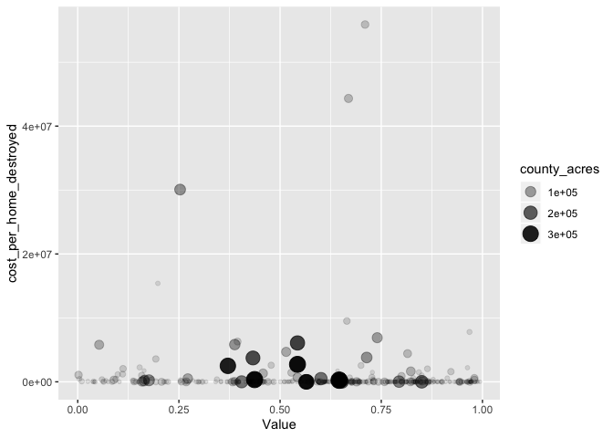
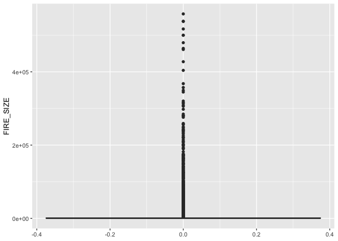

County wildfire analysis
================
Amy DiPierro
2020-05-01

  - [Setup](#setup)
      - [Join Karen Short’s data to
        SIT-209](#join-karen-shorts-data-to-sit-209)
      - [Join Karen + SIT-209 to MTBS (OR FIND GEOGRAPHY COLUMN in
        KAREN)](#join-karen-sit-209-to-mtbs-or-find-geography-column-in-karen)
      - [Count points in polygon](#count-points-in-polygon)
      - [Summarize fire counts, etc., by
        county](#summarize-fire-counts-etc.-by-county)
      - [Join Karen + SIT-209 + MTBS to SVI by county. Remember to use
        the right SVI
        years](#join-karen-sit-209-mtbs-to-svi-by-county.-remember-to-use-the-right-svi-years)
      - [Bin counties by SVI](#bin-counties-by-svi)
  - [Highlights from exploratory data
    analysis](#highlights-from-exploratory-data-analysis)
      - [Fires that threaten structures more-frequently burn
        more-vulnerable counties than less-vulnerable
        counties](#fires-that-threaten-structures-more-frequently-burn-more-vulnerable-counties-than-less-vulnerable-counties)
      - [Fires that destroyed structures hit more-vulnerable counties
        more frequently than less-vulnerable
        counties](#fires-that-destroyed-structures-hit-more-vulnerable-counties-more-frequently-than-less-vulnerable-counties)
      - [Fires in less-vulnerable places tend to be larger than fires in
        more-vulnerable
        places](#fires-in-less-vulnerable-places-tend-to-be-larger-than-fires-in-more-vulnerable-places)
      - [Fires in less-vulnerable places were more expensive per-acre
        than fires in more-vulnerable places
        (?)](#fires-in-less-vulnerable-places-were-more-expensive-per-acre-than-fires-in-more-vulnerable-places)
  - [More exploratory data analysis](#more-exploratory-data-analysis)
      - [Costs per acre by SVI (bin and no
        bin)](#costs-per-acre-by-svi-bin-and-no-bin)
      - [Homes threatened](#homes-threatened)
      - [Costs per house damaged or destroyed by SVI (bin and no
        bin)](#costs-per-house-damaged-or-destroyed-by-svi-bin-and-no-bin)
      - [Comparing medians](#comparing-medians)
      - [Total cost by bin](#total-cost-by-bin)
      - [Total acres burned by bin](#total-acres-burned-by-bin)
      - [Median total acres burned by
        bin](#median-total-acres-burned-by-bin)
      - [Mean total acres burned by
        bin](#mean-total-acres-burned-by-bin)
      - [Total destroyed by bin](#total-destroyed-by-bin)
      - [Ratio of total cost to homes destroyed by
        bin](#ratio-of-total-cost-to-homes-destroyed-by-bin)
      - [Ratio of total cost to homes threatened by
        bin](#ratio-of-total-cost-to-homes-threatened-by-bin)
  - [Basic EDA](#basic-eda)
      - [Typical size of all fires](#typical-size-of-all-fires)
      - [Typical size of fires by bin](#typical-size-of-fires-by-bin)
      - [Typical number of fires in a county each
        year](#typical-number-of-fires-in-a-county-each-year)
      - [Typical number of fires in a county each year, by
        bin](#typical-number-of-fires-in-a-county-each-year-by-bin)
      - [Typical cost of all fires](#typical-cost-of-all-fires)
      - [Typical cost of fires by bin](#typical-cost-of-fires-by-bin)
      - [Ratio of cost per acre](#ratio-of-cost-per-acre)
      - [county\_summary analysis](#county_summary-analysis)

``` r
# Libraries
library(tidyverse)
library(sf)
library(tidycensus)
library(dbplyr)

# Parameters

## All historical perimeters
file_geomac <- here::here("data-raw", "US_HIST_FIRE_PERIMTRS_DD83", "US_HIST_FIRE_PERIMTRS_DD83.shp")

## County SVI data
## Source: https://svi.cdc.gov/data-and-tools-download.html
## 2000 SVI - only tract level available
# file_svi_2000 <- here::here("data-raw", "SVI2000_US.csv")

# Source: https://ephtracking.cdc.gov/DataExplorer/?query=779a2b45-2309-4b81-a2d7-8040b78969a0
## 2010, 2014, 2016
file_svi_2010_14_16 <- here::here("data-raw", "EPHTN_M604_D_183208", "data_183209.csv")

## 2018 SVI
file_svi_2018 <- here::here("data-raw", "SVI2018_US_COUNTY", "SVI2018_US_county.shp")

# Monitoring Trends in Burn Severity: Burned Areas Boundary Dataset
# Source: https://www.mtbs.gov/direct-download
# Download date: 2020-04-21
# Geography: United States
# Years: 2006 - 2017
file_mtbs <- here::here("data-raw", "mtbs_perimeter_data", "mtbs_perims_DD.shp")

## SIT-209
file_sit209 <- here::here("data-raw", "wildfires_deduped.csv")

#===============================================================================

# Code

# Read in the SIT-209 data
sit209 <-
  file_sit209 %>% 
  read_csv(
    col_types = 
      cols(
        .default = col_character(),
        LATITUDE = col_double(),
        LONGITUDE = col_double(),
        ESTIMATED_COST = col_double(),
        REPORT_DATE = col_datetime(format = ""),
        MAX_PERSONNEL = col_double(),
        INCIDENT_AREA = col_double(),
        MAX_SFR_THREAT = col_double(),
        MAX_MFR_THREAT = col_double(),
        MAX_MU_THREAT = col_double(),
        MAX_COMM_THREAT = col_double(),
        MAX_OUTB_THREAT = col_double(),
        MAX_OTHER_THREAT = col_double(),
        SFR_DAMAGED = col_double(),
        MFR_DAMAGED = col_double(),
        MU_DAMAGED = col_double(),
        COMM_DAMAGED = col_double(),
        OTHER_DAMAGED = col_double(),
        SFR_DESTROYED = col_double(),
        MFR_DESTROYED = col_double(),
        MU_DESTROYED = col_double(),
        COMM_DESTROYED = col_double(),
        OUTB_DESTROYED = col_double(),
        OTHER_DESTROYED = col_double(),
        INJURIES = col_double(),
        FATALITIES = col_double(),
        REPORT_ID = col_character(),
        WILDFIRE = col_logical(),
        STATE_FIPS = col_character(),
        DESTROYED = col_logical(),
        THREATENED = col_logical(),
        CLIMATE_REGION = col_character()
      )
  )

# Read in the fire shapefile data
mtbs <-
  read_sf(file_mtbs)

## Read in the GEOMAC data

geomac <-
  read_sf(file_geomac)

## Read in the SVI data

svi_2010_14_16 <-
  read_sf(file_svi_2010_14_16)

svi_2018 <-
  read_sf(file_svi_2018)

# Connect to Karen Short's database
# Source: https://www.fs.usda.gov/rds/archive/catalog/RDS-2013-0009.4
con <-
  DBI::dbConnect(
    drv = RSQLite::SQLite(),
    dbname = here::here("data-raw", "RDS-2013-0009", "Data", "FPA_FOD_20170508.sqlite"),
  )

# Read the "Fires" table into a dataframe
karen <- DBI::dbReadTable(con, "Fires")

# Disconect the database
DBI::dbDisconnect(con)

# Get county geometries

counties <- 
  ussf::boundaries(geography = c("county"), projection = c("longlat")) %>% 
  st_transform(crs = 4269)
```

# Setup

## Join Karen Short’s data to SIT-209

``` r
sit_karen <-
  sit209 %>% 
  left_join(karen, by = c("INCIDENT_NUMBER" = "ICS_209_INCIDENT_NUMBER")) %>% 
  drop_na(INCIDENT_NUMBER) %>% 
  mutate(
    county_fips = as.character(str_glue("{STATE_FIPS}{FIPS_CODE}")),
    bin_year = 
      # TODO: Revisit whether this binning scheme is legitimate
      case_when(
        REPORT_YEAR <= 2009 ~ -999,
        REPORT_YEAR <= 2012 ~ 2010,
        REPORT_YEAR <= 2014 ~ 2014,
        REPORT_YEAR <= 2016 ~ 2016,
        REPORT_YEAR <= 2018 ~ 2018
      ),
    year_fips = str_glue("{bin_year}_{county_fips}")
  )
```

## Join Karen + SIT-209 to MTBS (OR FIND GEOGRAPHY COLUMN in KAREN)

``` r
sit_karen_mtbs <-
  sit_karen %>% 
  left_join(mtbs, by = c("MTBS_ID" = "Fire_ID")) 
```

Let’s see how this worked out.

We can see from the following that geometry is the most complete way to
join to other data.

``` r
sit_karen_mtbs %>% 
  summarize_all(~ sum(is.na(.))) %>% 
  select(STATE_FIPS, COUNTY.y, FIPS_CODE, FIPS_NAME, LATITUDE.x, LONGITUDE.x, geometry)
```

    ## # A tibble: 1 x 7
    ##   STATE_FIPS COUNTY.y FIPS_CODE FIPS_NAME LATITUDE.x LONGITUDE.x geometry
    ##        <int>    <int>     <int>     <int>      <int>       <int>    <int>
    ## 1          0    19384     19384     19384       1212        1195        0

But, then again, FIPS code is generally only missing in the case of
fires where we lack lots of other information already, so including
records without FIPS\_CODE might only have limited added benefit.

``` r
sit_karen_mtbs %>% 
  filter(is.na(FIPS_CODE)) %>% 
  summarise_all(~ sum(is.na(.)))
```

    ## # A tibble: 1 x 90
    ##   REPORT_YEAR FORM_TYPE INTERNAL_DB_ID INCIDENT_NUMBER INCIDENT_NAME
    ##         <int>     <int>          <int>           <int>         <int>
    ## 1           0         0          10393               0            17
    ## # … with 85 more variables: INCIDENT_TYPE <int>, STATE.x <int>, COUNTY.x <int>,
    ## #   LATITUDE.x <int>, LONGITUDE.x <int>, START_DATE <int>, END_DATE <int>,
    ## #   CAUSE <int>, ESTIMATED_COST <int>, REPORT_DATE <int>, MAX_PERSONNEL <int>,
    ## #   INCIDENT_AREA <int>, MAX_SFR_THREAT <int>, MAX_MFR_THREAT <int>,
    ## #   MAX_MU_THREAT <int>, MAX_COMM_THREAT <int>, MAX_OUTB_THREAT <int>,
    ## #   MAX_OTHER_THREAT <int>, SFR_DAMAGED <int>, MFR_DAMAGED <int>,
    ## #   MU_DAMAGED <int>, COMM_DAMAGED <int>, OTHER_DAMAGED <int>,
    ## #   SFR_DESTROYED <int>, MFR_DESTROYED <int>, MU_DESTROYED <int>,
    ## #   COMM_DESTROYED <int>, OUTB_DESTROYED <int>, OTHER_DESTROYED <int>,
    ## #   INJURIES <int>, FATALITIES <int>, REPORT_ID <int>, WILDFIRE <int>,
    ## #   STATE_FIPS <int>, DESTROYED <int>, THREATENED <int>, CLIMATE_REGION <int>,
    ## #   OBJECTID <int>, FOD_ID <int>, FPA_ID <int>, SOURCE_SYSTEM_TYPE <int>,
    ## #   SOURCE_SYSTEM <int>, NWCG_REPORTING_AGENCY <int>,
    ## #   NWCG_REPORTING_UNIT_ID <int>, NWCG_REPORTING_UNIT_NAME <int>,
    ## #   SOURCE_REPORTING_UNIT <int>, SOURCE_REPORTING_UNIT_NAME <int>,
    ## #   LOCAL_FIRE_REPORT_ID <int>, LOCAL_INCIDENT_ID <int>, FIRE_CODE <int>,
    ## #   FIRE_NAME <int>, ICS_209_NAME <int>, MTBS_ID <int>, MTBS_FIRE_NAME <int>,
    ## #   COMPLEX_NAME <int>, FIRE_YEAR <int>, DISCOVERY_DATE <int>,
    ## #   DISCOVERY_DOY <int>, DISCOVERY_TIME <int>, STAT_CAUSE_CODE <int>,
    ## #   STAT_CAUSE_DESCR <int>, CONT_DATE <int>, CONT_DOY <int>, CONT_TIME <int>,
    ## #   FIRE_SIZE <int>, FIRE_SIZE_CLASS <int>, LATITUDE.y <int>,
    ## #   LONGITUDE.y <int>, OWNER_CODE <int>, OWNER_DESCR <int>, STATE.y <int>,
    ## #   COUNTY.y <int>, FIPS_CODE <int>, FIPS_NAME <int>, Shape <int>,
    ## #   county_fips <int>, bin_year <int>, year_fips <int>, Fire_Name <int>,
    ## #   Year <int>, StartMonth <int>, StartDay <int>, Fire_Type <int>, Acres <int>,
    ## #   geometry <int>

``` r
sit_karen_mtbs %>% 
  count(is.na(FIPS_CODE), is.na(COUNTY.x), is.na(COUNTY.y))
```

    ## # A tibble: 4 x 4
    ##   `is.na(FIPS_CODE)` `is.na(COUNTY.x)` `is.na(COUNTY.y)`     n
    ##   <lgl>              <lgl>             <lgl>             <int>
    ## 1 FALSE              FALSE             FALSE             16221
    ## 2 FALSE              TRUE              FALSE              1870
    ## 3 TRUE               FALSE             TRUE              16682
    ## 4 TRUE               TRUE              TRUE               2702

## Count points in polygon

  - Get centroids of each fire

<!-- end list -->

``` r
centroids <-
  sit_karen_mtbs %>% 
  mutate(centroid = st_centroid(geometry))
```

    ## Warning in st_centroid.sfc(geometry): st_centroid does not give correct
    ## centroids for longitude/latitude data

  - Join to all county geographies

<!-- end list -->

``` r
#TODO: CHECK THAT THIS WORKED
#TODO: Count the points in the actual polygons
centroids_counties <-
  centroids %>% 
  st_as_sf() %>% 
  st_join(counties, join = st_within) 
```

    ## although coordinates are longitude/latitude, st_within assumes that they are planar

## Summarize fire counts, etc., by county

``` r
county_summary <-
  sit_karen_mtbs %>% 
  select(-Shape) %>% 
  group_by(county_fips, REPORT_YEAR, year_fips, bin_year) %>% 
  summarize(
    county_fires = n(),
    county_acres = sum(FIRE_SIZE, na.rm = TRUE),
    county_cost = sum(ESTIMATED_COST, na.rm = TRUE),
    county_homes_destroyed = sum(SFR_DESTROYED, na.rm = TRUE),
    county_homes_damaged = sum(SFR_DAMAGED, na.rm = TRUE),
    county_homes_threatened = sum(MAX_SFR_THREAT, na.rm = TRUE),
    county_personnel = sum(MAX_PERSONNEL, na.rm = TRUE),
    county_cost_per_acre = county_cost / county_acres,
    county_median_acres = median(FIRE_SIZE, na.rm = TRUE),
    county_median_cost = median(ESTIMATED_COST, na.rm = TRUE),
    destroyed_count = sum(DESTROYED, na.rm = TRUE),
    threatened_count = sum(THREATENED, na.rm = TRUE)
  ) %>% 
  ungroup() 
```

Note that each record in `county_summary` gives stats for a county in a
given year.

## Join Karen + SIT-209 + MTBS to SVI by county. Remember to use the right SVI years

  - Prepare the join by combining SVI into one dataframe and adding a
    new unique ID to join on.

We wrangle the 2018 data first to match the rest of the data.

``` r
svi_2018_wrangled <-
  svi_2018 %>% 
  mutate(
    Year = "2018",
    FIPS = as.double(FIPS),
    FIPS = as.character(FIPS),
    year_fips = str_glue("{Year}_{FIPS}")
  ) %>% 
  select(
    "stateFIPS" = ST,
    "State" = STATE,
    "countyFIPS" = FIPS,
    "County" = COUNTY,
    Year,
    "Value" = RPL_THEMES,
    year_fips
  )
```

Then we wrangle the rest of the data a little.

``` r
svi_10_14_16_wrangled <-
  svi_2010_14_16 %>% 
  mutate(
    countyFIPS = as.double(countyFIPS),
    countyFIPS = as.character(countyFIPS),
    year_fips = str_glue("{Year}_{countyFIPS}"),
    Value = as.double(Value)
  ) %>% 
  select(-`Data Comment`, -field_8) 
```

    ## Warning: NAs introduced by coercion

Now we can combine the two.

``` r
svi <-
  svi_10_14_16_wrangled %>% 
  bind_rows(svi_2018_wrangled) %>% 
  select(-geometry)
```

    ## Warning in bind_rows_(x, .id): Vectorizing 'glue' elements may not preserve
    ## their attributes
    
    ## Warning in bind_rows_(x, .id): Vectorizing 'glue' elements may not preserve
    ## their attributes

    ## Warning in bind_rows_(x, .id): Vectorizing 'sfc_MULTIPOLYGON' elements may not
    ## preserve their attributes

  - FInally, join to the fires data

<!-- end list -->

``` r
fires_svi <-
  county_summary %>%
  filter(bin_year != -999) %>% 
  mutate(year_fips = as.character(year_fips)) %>% 
  left_join(svi, by = c("year_fips"))
```

## Bin counties by SVI

``` r
fires_svi_binned <-
 fires_svi %>%  
  mutate(
    bucket =
      case_when(
        Value == 1 ~ 1,
        Value > 0.95 ~ 0.95,
        Value > 0.9 ~ 0.9,
        Value > 0.85 ~ 0.85,
        Value > 0.8 ~ 0.8,
        Value > 0.75 ~ 0.75,
        Value > 0.7 ~ 0.7,
        Value > 0.65 ~ 0.65,
        Value > 0.6 ~ 0.6,
        Value > 0.55 ~ 0.55,
        Value > 0.5 ~ 0.5,
        Value > 0.45 ~ 0.45,
        Value > 0.4 ~ 0.4,
        Value > 0.35 ~ 0.35,
        Value > 0.3 ~ 0.3,
        Value > 0.25 ~ 0.25,
        Value > 0.2 ~ 0.2,
        Value > 0.15 ~ 0.15,
        Value > 0.1 ~ 0.1,
        Value > 0.05 ~ 0.05,
        Value > 0 ~ 0,
        Value == 0 ~ -0.05,
        TRUE ~ NA_real_ 
      )
  )
```

# Highlights from exploratory data analysis

Please regard the following as extremely preliminary. We’ll want to very
carefully check the robustness of the relationships these plots seem to
show. As you will find by looking at the next section, “More exploratory
data analysis”, there are plenty of reasons to doubt these plots.

### Fires that threaten structures more-frequently burn more-vulnerable counties than less-vulnerable counties

In the following code chunk, I find the total number of fires that
threatened structures in each SVI bucket.

``` r
fires_svi_binned %>% 
  group_by(bucket) %>% 
  summarize(n = sum(threatened_count)) %>% 
  filter(n < 300) %>% 
  ggplot(aes(x = bucket, y = n)) +
  geom_col(position = "dodge") +
  geom_smooth() +
  labs(
    title = "Number of fires that threatened structures, 2010-2018",
    x = 
      "← Less vulnerable                Social vulnerability                More vulnerable →",
    y = "Number of fires that threaten structures"
  )
```

    ## `geom_smooth()` using method = 'loess' and formula 'y ~ x'

<!-- -->

This plot suggests that there are genererally more fires that threatened
structures in counties with higher SVI scores (as in, communities that
are deemed more vulnerable) than in communities with lower SVI scores
(which are deemed less vulnerable).

### Fires that destroyed structures hit more-vulnerable counties more frequently than less-vulnerable counties

``` r
fires_svi_binned %>% 
  group_by(bucket) %>% 
  summarize(n = sum(destroyed_count)) %>% 
  filter(n < 200) %>% 
  ggplot(aes(x = bucket, y = n)) +
  geom_col(position = "dodge") +
  geom_smooth() +
  labs(
    title = "Number of fires that destroyed structures, 2010-2018",
    x = 
      "← Less vulnerable                Social vulnerability                More vulnerable →",
    y = "Number of fires that destroyed structures"
  )
```

    ## `geom_smooth()` using method = 'loess' and formula 'y ~ x'

<!-- -->

### Fires in less-vulnerable places tend to be larger than fires in more-vulnerable places

``` r
fires_svi_binned %>% 
  left_join(sit_karen_mtbs, by = c("year_fips")) %>% 
  drop_na(bucket) %>% 
  group_by(bucket) %>% 
  summarize(
    median_acres = median(FIRE_SIZE, na.rm = TRUE)
  ) %>% 
  ggplot(aes(x = bucket, y = median_acres)) +
  geom_col() +
  geom_smooth() +
    labs(
    title = "Median size of fire by SVI bucket, 2010-2018",
    x = 
      "← Less vulnerable                Social vulnerability                More vulnerable →",
    y = "Median size of fire"
  )
```

    ## Warning: Column `year_fips` has different attributes on LHS and RHS of join

    ## `geom_smooth()` using method = 'loess' and formula 'y ~ x'

<!-- -->

### Fires in less-vulnerable places were more expensive per-acre than fires in more-vulnerable places (?)

``` r
fires_svi_binned %>% 
  left_join(sit_karen_mtbs, by = c("year_fips")) %>% 
  drop_na(bucket) %>% 
  group_by(bucket) %>% 
  summarize(
    cost = sum(ESTIMATED_COST, na.rm = TRUE),
    acres = sum(FIRE_SIZE, na.rm = TRUE)
  ) %>% 
  filter(acres > 0) %>% 
  mutate(cost_per_acre = cost / acres) %>% 
  ggplot(aes(x = bucket, y = cost_per_acre)) +
  geom_col(position = "dodge") +
  geom_smooth() +
    labs(
    title = "Cost per acre by SVI bucket, 2010-2018",
    x = 
      "← Less vulnerable                Social vulnerability                More vulnerable →",
    y = "Cost per acre"
  )
```

    ## Warning: Column `year_fips` has different attributes on LHS and RHS of join

    ## `geom_smooth()` using method = 'loess' and formula 'y ~ x'

<!-- -->

# More exploratory data analysis

## Costs per acre by SVI (bin and no bin)

``` r
fires_svi %>% 
  drop_na(Value) %>% 
  filter(
    county_cost > 0,
    county_cost_per_acre < 1e+06
  ) %>% 
  ggplot() +
  geom_point(
    aes(
      x = Value, 
      y = county_cost_per_acre,
      size = county_fires
    )
  )
```

<!-- -->

``` r
fires_svi_binned %>% 
  drop_na(Value) %>% 
  filter(
    county_cost > 0,
    county_cost_per_acre < 1e+06
  ) %>% 
  ggplot() +
  geom_col(aes(x = bucket, y = county_cost_per_acre), position = "dodge")
```

<!-- -->

## Homes threatened

``` r
fires_svi %>% 
  drop_na(Value) %>% 
  ggplot() +
  geom_point(
    aes(
      x = Value, 
      y = county_homes_threatened, 
      size = county_acres, 
      alpha = county_acres
    )
  )
```

<!-- -->

``` r
fires_svi_binned %>% 
  drop_na(Value) %>%
  group_by(bucket) %>% 
  summarize(threatened = sum(county_homes_threatened, na.rm = TRUE)) %>% 
  ggplot() +
  geom_col(aes(x = bucket, y = threatened), position = "dodge")
```

<!-- -->

## Costs per house damaged or destroyed by SVI (bin and no bin)

``` r
fires_svi %>% 
  drop_na(Value) %>% 
  filter(county_homes_destroyed > 0) %>% 
  mutate(cost_per_home_destroyed = county_cost / county_homes_destroyed) %>% 
  ggplot() +
  geom_point(
    aes(
      x = Value, 
      y = cost_per_home_destroyed, 
      size = county_acres, 
      alpha = county_acres
    )
  )
```

<!-- -->

``` r
fires_svi_binned %>% 
  drop_na(Value) %>% 
  filter(county_homes_destroyed > 0) %>% 
  mutate(cost_per_home_destroyed = county_cost / county_homes_destroyed) %>% 
  ggplot() +
  geom_col(aes(x = bucket, y = cost_per_home_destroyed), position = "dodge")
```

<!-- -->

## Comparing medians

``` r
fires_svi %>% 
  drop_na(Value) %>% 
  ggplot() +
  geom_point(
    aes(
      x = Value, 
      y = county_median_cost, 
      alpha = county_acres
    )
  )
```

    ## Warning: Removed 951 rows containing missing values (geom_point).

<!-- -->

## Total cost by bin

``` r
fires_svi_binned %>%
  group_by(bucket) %>% 
  summarize(total = sum(county_cost, na.rm = TRUE)) %>% 
  ggplot() +
  geom_col(aes(y = total, x = bucket))
```

    ## Warning: Removed 1 rows containing missing values (position_stack).

<!-- -->

## Total acres burned by bin

``` r
fires_svi_binned %>%
  group_by(bucket) %>% 
  summarize(total = sum(county_acres, na.rm = TRUE)) %>% 
  ggplot() +
  geom_col(aes(y = total, x = bucket))
```

    ## Warning: Removed 1 rows containing missing values (position_stack).

<!-- -->

## Median total acres burned by bin

``` r
fires_svi_binned %>%
  group_by(bucket) %>% 
  summarize(median = median(county_acres, na.rm = TRUE)) %>% 
  ggplot() +
  geom_col(aes(y = median, x = bucket))
```

    ## Warning: Removed 1 rows containing missing values (position_stack).

<!-- -->

## Mean total acres burned by bin

``` r
fires_svi_binned %>%
  group_by(bucket) %>% 
  summarize(mean = mean(county_acres, na.rm = TRUE)) %>% 
  ggplot() +
  geom_col(aes(y = mean, x = bucket))
```

    ## Warning: Removed 1 rows containing missing values (position_stack).

<!-- -->

## Total destroyed by bin

``` r
fires_svi_binned %>%
  group_by(bucket) %>% 
  summarize(total = sum(county_homes_destroyed, na.rm = TRUE)) %>% 
  ggplot() +
  geom_col(aes(y = total, x = bucket))
```

    ## Warning: Removed 1 rows containing missing values (position_stack).

<!-- -->

## Ratio of total cost to homes destroyed by bin

``` r
fires_svi_binned %>%
  group_by(bucket) %>% 
  summarize(
    homes_destroyed = sum(county_homes_destroyed, na.rm = TRUE),
    costs = sum(county_cost, na.rm = TRUE),
    costs_per_home = costs / homes_destroyed
  ) %>% 
  ggplot() +
  geom_col(aes(y = costs_per_home, x = bucket))
```

    ## Warning: Removed 1 rows containing missing values (position_stack).

<!-- -->

Ignore the infinity values.

## Ratio of total cost to homes threatened by bin

``` r
fires_svi_binned %>%
  group_by(bucket) %>% 
  summarize(
    homes_threatened = sum(county_homes_threatened, na.rm = TRUE),
    costs = sum(county_cost, na.rm = TRUE),
    costs_per_home = costs / homes_threatened
  ) %>% 
  ggplot() +
  geom_col(aes(y = costs_per_home, x = bucket))
```

    ## Warning: Removed 1 rows containing missing values (position_stack).

<!-- -->

Again, ignore the infinity value.

# Basic EDA

## Typical size of all fires

``` r
sit_karen_mtbs %>% 
  ggplot() +
  geom_histogram(aes(FIRE_SIZE))
```

    ## `stat_bin()` using `bins = 30`. Pick better value with `binwidth`.

    ## Warning: Removed 12842 rows containing non-finite values (stat_bin).

<!-- -->

``` r
sit_karen_mtbs %>%
  filter(FIRE_SIZE > 100) %>% 
  ggplot() +
  geom_histogram(aes(FIRE_SIZE))
```

    ## `stat_bin()` using `bins = 30`. Pick better value with `binwidth`.

<!-- -->

``` r
sit_karen_mtbs %>%
  filter(FIRE_SIZE > 1000) %>% 
  ggplot() +
  geom_histogram(aes(FIRE_SIZE))
```

    ## `stat_bin()` using `bins = 30`. Pick better value with `binwidth`.

<!-- -->

``` r
sit_karen_mtbs %>%
  filter(FIRE_SIZE > 0) %>% 
  ggplot() +
  geom_boxplot(aes(y = FIRE_SIZE))
```

<!-- -->

## Typical size of fires by bin

``` r
fires_svi_binned %>% 
  ggplot() +
  geom_boxplot(aes(y = county_median_acres)) +
  facet_wrap(facets = vars(bucket))
```

    ## Warning: Removed 245 rows containing non-finite values (stat_boxplot).

<!-- -->

## Typical number of fires in a county each year

``` r
county_summary %>% 
  filter(!str_detect(county_fips, "NA")) %>% 
  ggplot() +
  geom_boxplot(aes(y = county_fires))
```

<!-- -->

``` r
county_summary %>% 
  filter(!str_detect(county_fips, "NA")) %>% 
  arrange(desc(county_fires))
```

    ## # A tibble: 6,769 x 16
    ##    county_fips REPORT_YEAR year_fips bin_year county_fires county_acres
    ##    <chr>       <chr>       <glue>       <dbl>        <int>        <dbl>
    ##  1 16049       2006        -999_160…     -999           90      133211.
    ##  2 6105        2008        -999_6105     -999           82      270179.
    ##  3 16049       2003        -999_160…     -999           74      183826.
    ##  4 16085       2006        -999_160…     -999           73      134805.
    ##  5 16049       2007        -999_160…     -999           72      369956.
    ##  6 16049       2002        -999_160…     -999           63       20641.
    ##  7 16049       2012        2010_160…     2010           59      244628.
    ##  8 16049       2005        -999_160…     -999           57       80650.
    ##  9 16049       2013        2014_160…     2014           56       23808.
    ## 10 16049       2001        -999_160…     -999           41       34490 
    ## # … with 6,759 more rows, and 10 more variables: county_cost <dbl>,
    ## #   county_homes_destroyed <dbl>, county_homes_damaged <dbl>,
    ## #   county_homes_threatened <dbl>, county_personnel <dbl>,
    ## #   county_cost_per_acre <dbl>, county_median_acres <dbl>,
    ## #   county_median_cost <dbl>, destroyed_count <int>, threatened_count <int>

## Typical number of fires in a county each year, by bin

``` r
fires_svi_binned %>% 
  filter(!str_detect(county_fips, "NA")) %>% 
  ggplot() +
  geom_boxplot(aes(y = county_fires, group = bucket))
```

<!-- -->

## Typical cost of all fires

``` r
sit209 %>% 
  drop_na(ESTIMATED_COST) %>% 
  ggplot() +
  geom_histogram(aes(ESTIMATED_COST))
```

    ## `stat_bin()` using `bins = 30`. Pick better value with `binwidth`.

<!-- -->

## Typical cost of fires by bin

``` r
fires_svi_binned %>% 
  left_join(sit_karen_mtbs, by = c("year_fips")) %>% 
  drop_na(ESTIMATED_COST, bucket) %>% 
  group_by(bucket) %>% 
  summarize(median_cost = median(ESTIMATED_COST)) %>% 
  ggplot(aes(x = bucket, y = median_cost)) +
  geom_col(position = "dodge")
```

    ## Warning: Column `year_fips` has different attributes on LHS and RHS of join

<!-- -->

``` r
fires_svi_binned %>% 
  left_join(sit_karen_mtbs, by = c("year_fips")) %>% 
  drop_na(ESTIMATED_COST, bucket) %>% 
  group_by(bucket) %>% 
  summarize(mean_cost = mean(ESTIMATED_COST)) %>% 
  ggplot(aes(x = bucket, y = mean_cost)) +
  geom_col(position = "dodge")
```

    ## Warning: Column `year_fips` has different attributes on LHS and RHS of join

<!-- -->

## Ratio of cost per acre

``` r
fires_svi_binned %>% 
  left_join(sit_karen_mtbs, by = c("year_fips")) %>% 
  drop_na(bucket) %>% 
  group_by(bucket) %>% 
  summarize(
    cost = sum(ESTIMATED_COST, na.rm = TRUE),
    acres = sum(FIRE_SIZE, na.rm = TRUE)
  ) %>% 
  filter(acres > 0) %>% 
  mutate(cost_per_acre = cost / acres) %>% 
  ggplot(aes(x = bucket, y = cost_per_acre)) +
  geom_col(position = "dodge")
```

    ## Warning: Column `year_fips` has different attributes on LHS and RHS of join

<!-- -->

## county\_summary analysis

``` r
county_summary %>% 
  group_by(REPORT_YEAR) %>% 
  summarize(destructive_fires = sum(destroyed_count)) %>% 
  ggplot() +
  geom_point(aes(x = REPORT_YEAR, y = destructive_fires)) +
  geom_line(aes(x = REPORT_YEAR, y = destructive_fires))
```

    ## geom_path: Each group consists of only one observation. Do you need to adjust
    ## the group aesthetic?

<!-- -->

``` r
county_summary %>% 
  group_by(county_fips) %>% 
  summarize(destructive_fires = sum(destroyed_count)) %>% 
  filter(!str_detect(county_fips, "NA")) %>% 
  arrange(desc(destructive_fires))
```

    ## # A tibble: 1,675 x 2
    ##    county_fips destructive_fires
    ##    <chr>                   <int>
    ##  1 53007                      46
    ##  2 6105                       46
    ##  3 6063                       31
    ##  4 12105                      29
    ##  5 45075                      26
    ##  6 32007                      24
    ##  7 6065                       24
    ##  8 27115                      22
    ##  9 45025                      21
    ## 10 16039                      20
    ## # … with 1,665 more rows

``` r
sit_karen_mtbs %>% 
  filter(county_fips == "6105") # Trinity County California
```

    ## # A tibble: 121 x 90
    ##    REPORT_YEAR FORM_TYPE INTERNAL_DB_ID INCIDENT_NUMBER INCIDENT_NAME
    ##    <chr>       <chr>     <chr>          <chr>           <chr>        
    ##  1 1999        a         <NA>           CA-RCC-4578     LOWDEN (CA-S…
    ##  2 2006        b         <NA>           CA-SRF-000999   PANTHER      
    ##  3 2006        b         <NA>           CA-SHF-2120     PIGEON       
    ##  4 2006        b         <NA>           CA-SHF-001693   BAR COMPLEX  
    ##  5 2006        b         <NA>           CA-MNF-897      KINGSLEY COM…
    ##  6 2006        b         <NA>           CA-MNF-897      KINGSLEY COM…
    ##  7 2007        b         <NA>           CA-MNF-1050     YOLLA BOLLY …
    ##  8 2007        b         <NA>           CA-MNF-1050     YOLLA BOLLY …
    ##  9 2007        b         <NA>           CA-MNF-1050     YOLLA BOLLY …
    ## 10 2007        b         <NA>           CA-MNF-1050     YOLLA BOLLY …
    ## # … with 111 more rows, and 85 more variables: INCIDENT_TYPE <chr>,
    ## #   STATE.x <chr>, COUNTY.x <chr>, LATITUDE.x <dbl>, LONGITUDE.x <dbl>,
    ## #   START_DATE <chr>, END_DATE <chr>, CAUSE <chr>, ESTIMATED_COST <dbl>,
    ## #   REPORT_DATE <dttm>, MAX_PERSONNEL <dbl>, INCIDENT_AREA <dbl>,
    ## #   MAX_SFR_THREAT <dbl>, MAX_MFR_THREAT <dbl>, MAX_MU_THREAT <dbl>,
    ## #   MAX_COMM_THREAT <dbl>, MAX_OUTB_THREAT <dbl>, MAX_OTHER_THREAT <dbl>,
    ## #   SFR_DAMAGED <dbl>, MFR_DAMAGED <dbl>, MU_DAMAGED <dbl>, COMM_DAMAGED <dbl>,
    ## #   OTHER_DAMAGED <dbl>, SFR_DESTROYED <dbl>, MFR_DESTROYED <dbl>,
    ## #   MU_DESTROYED <dbl>, COMM_DESTROYED <dbl>, OUTB_DESTROYED <dbl>,
    ## #   OTHER_DESTROYED <dbl>, INJURIES <dbl>, FATALITIES <dbl>, REPORT_ID <chr>,
    ## #   WILDFIRE <lgl>, STATE_FIPS <chr>, DESTROYED <lgl>, THREATENED <lgl>,
    ## #   CLIMATE_REGION <chr>, OBJECTID <int>, FOD_ID <int>, FPA_ID <chr>,
    ## #   SOURCE_SYSTEM_TYPE <chr>, SOURCE_SYSTEM <chr>, NWCG_REPORTING_AGENCY <chr>,
    ## #   NWCG_REPORTING_UNIT_ID <chr>, NWCG_REPORTING_UNIT_NAME <chr>,
    ## #   SOURCE_REPORTING_UNIT <chr>, SOURCE_REPORTING_UNIT_NAME <chr>,
    ## #   LOCAL_FIRE_REPORT_ID <chr>, LOCAL_INCIDENT_ID <chr>, FIRE_CODE <chr>,
    ## #   FIRE_NAME <chr>, ICS_209_NAME <chr>, MTBS_ID <chr>, MTBS_FIRE_NAME <chr>,
    ## #   COMPLEX_NAME <chr>, FIRE_YEAR <int>, DISCOVERY_DATE <dbl>,
    ## #   DISCOVERY_DOY <int>, DISCOVERY_TIME <chr>, STAT_CAUSE_CODE <dbl>,
    ## #   STAT_CAUSE_DESCR <chr>, CONT_DATE <dbl>, CONT_DOY <int>, CONT_TIME <chr>,
    ## #   FIRE_SIZE <dbl>, FIRE_SIZE_CLASS <chr>, LATITUDE.y <dbl>,
    ## #   LONGITUDE.y <dbl>, OWNER_CODE <dbl>, OWNER_DESCR <chr>, STATE.y <chr>,
    ## #   COUNTY.y <chr>, FIPS_CODE <chr>, FIPS_NAME <chr>, Shape <blob>,
    ## #   county_fips <chr>, bin_year <dbl>, year_fips <glue>, Fire_Name <chr>,
    ## #   Year <dbl>, StartMonth <dbl>, StartDay <dbl>, Fire_Type <chr>, Acres <dbl>,
    ## #   geometry <MULTIPOLYGON [°]>
