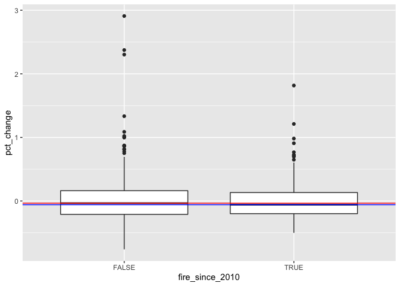
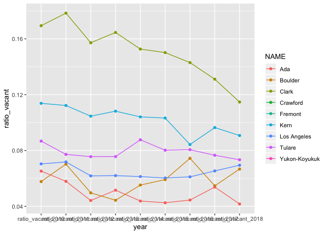
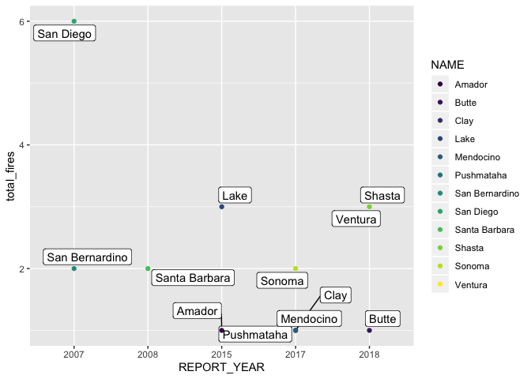
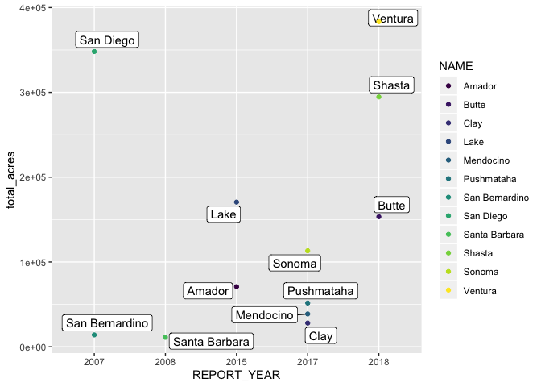
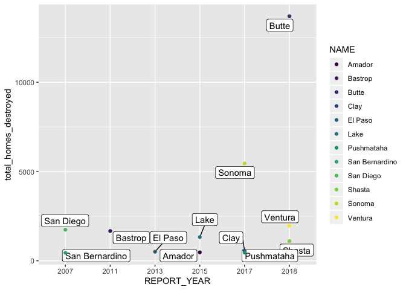
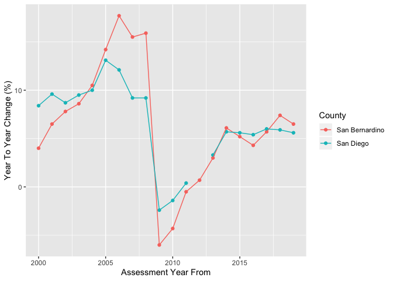
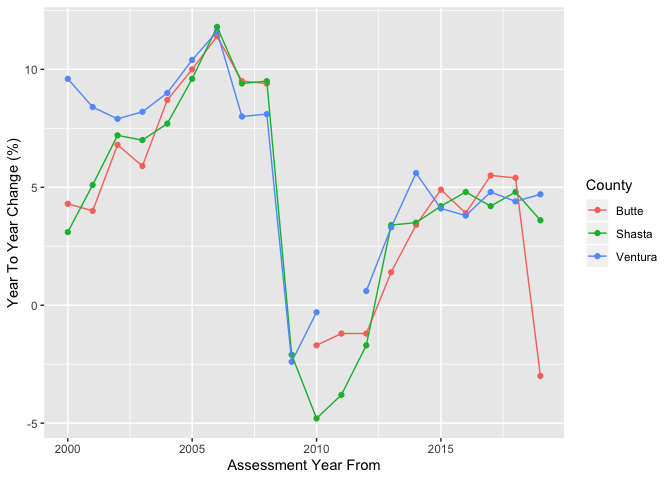
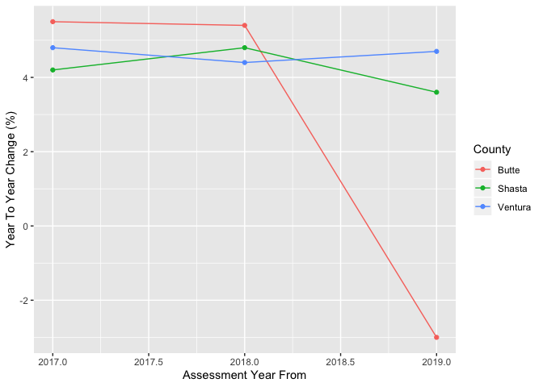
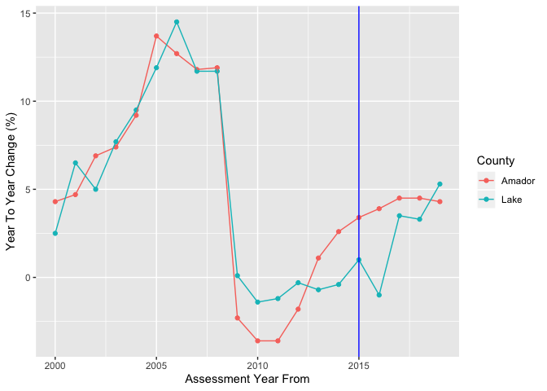

SIT-209 + Recovery metrics
================
Amy DiPierro
2020-05-06

  - [Summary](#summary)
  - [Data wrangling](#data-wrangling)
  - [Summarizing at the county level](#summarizing-at-the-county-level)
  - [Joining to occupancy metrics](#joining-to-occupancy-metrics)
  - [Property assessments in
    California](#property-assessments-in-california)

``` r
# Libraries
library(tidyverse)
```

    ## ── Attaching packages ───────────────────────────────────────────────────────────────────────────────────────────────── tidyverse 1.3.0 ──

    ## ✓ ggplot2 3.2.1     ✓ purrr   0.3.3
    ## ✓ tibble  2.1.3     ✓ dplyr   0.8.4
    ## ✓ tidyr   1.0.2     ✓ stringr 1.4.0
    ## ✓ readr   1.3.1     ✓ forcats 0.5.0

    ## ── Conflicts ──────────────────────────────────────────────────────────────────────────────────────────────────── tidyverse_conflicts() ──
    ## x dplyr::filter() masks stats::filter()
    ## x dplyr::lag()    masks stats::lag()

``` r
library(jsonlite)
```

    ## 
    ## Attaching package: 'jsonlite'

    ## The following object is masked from 'package:purrr':
    ## 
    ##     flatten

``` r
library(sf)
```

    ## Linking to GEOS 3.7.2, GDAL 2.4.2, PROJ 5.2.0

``` r
library(tidycensus)

# Parameters

## SIT-209
file_sit209 <- here::here("data-raw", "wildfires_deduped.csv")

## Tax data
## Source: https://www.boe.ca.gov/dataportal/dataset.htm?url=PropTaxAssessedValueStateCounty
file_taxes <- here::here("data-raw", "PropTaxAssessedValueStateCounty.csv")

#===============================================================================

# Code

# Read in the SIT-209 data
sit209 <-
  file_sit209 %>% 
  read_csv(
    col_types = 
      cols(
        .default = col_character(),
        LATITUDE = col_double(),
        LONGITUDE = col_double(),
        ESTIMATED_COST = col_double(),
        REPORT_DATE = col_datetime(format = ""),
        MAX_PERSONNEL = col_double(),
        INCIDENT_AREA = col_double(),
        MAX_SFR_THREAT = col_double(),
        MAX_MFR_THREAT = col_double(),
        MAX_MU_THREAT = col_double(),
        MAX_COMM_THREAT = col_double(),
        MAX_OUTB_THREAT = col_double(),
        MAX_OTHER_THREAT = col_double(),
        SFR_DAMAGED = col_double(),
        MFR_DAMAGED = col_double(),
        MU_DAMAGED = col_double(),
        COMM_DAMAGED = col_double(),
        OTHER_DAMAGED = col_double(),
        SFR_DESTROYED = col_double(),
        MFR_DESTROYED = col_double(),
        MU_DESTROYED = col_double(),
        COMM_DESTROYED = col_double(),
        OUTB_DESTROYED = col_double(),
        OTHER_DESTROYED = col_double(),
        INJURIES = col_double(),
        FATALITIES = col_double(),
        REPORT_ID = col_character(),
        WILDFIRE = col_logical(),
        STATE_FIPS = col_character(),
        DESTROYED = col_logical(),
        THREATENED = col_logical(),
        CLIMATE_REGION = col_character()
      )
  )

# Read in county data

counties <- 
  ussf::boundaries(geography = c("county"), projection = c("longlat")) %>% 
  st_transform(crs = 4269)

# Read in the tax data

taxes <- read_csv(file_taxes)
```

    ## Parsed with column specification:
    ## cols(
    ##   `Assessment Year From` = col_double(),
    ##   `Assessment Year To` = col_double(),
    ##   County = col_character(),
    ##   `Land Assessed Value` = col_double(),
    ##   `Improvements Assessed Value` = col_double(),
    ##   `Personal Property Assessed Value` = col_double(),
    ##   Exemptions = col_double(),
    ##   `Net Total` = col_double(),
    ##   `Year To Year Change (%)` = col_double()
    ## )

# Summary

Progress so far:

  - Used one method to assign one county to each wildfire in the SIT-209
  - Joined this summarized data to home occupancy data from the Census
    and did preliminary analysis
  - Read in property tax data in California to be explored

Next steps:

  - Revisit the method used to assign one county per wildfire. Consider
    using wildfire perimeters and, maybe, some measure of population
    density to split SIT-209 stats for a single fire among more than one
    county.
  - Consider other recovery metrics.

# Data wrangling

The following analysis will focus only on **fires in which at least one
single-family home was destroyed.**

Of this subset of fires, how many don’t have latitude or longitude?
Since there are disasters that aren’t wildfires in this data, we’ll
limit ourselves to wildfires specifically.

``` r
sit209 %>% 
  filter(
    SFR_DESTROYED > 0,
    INCIDENT_TYPE %in% c("Complex", "Wildfire", "WF", "WFU")
  ) %>% 
  count(is.na(LONGITUDE) | is.na(LATITUDE))
```

    ## # A tibble: 2 x 2
    ##   `is.na(LONGITUDE) | is.na(LATITUDE)`     n
    ##   <lgl>                                <int>
    ## 1 FALSE                                 1993
    ## 2 TRUE                                    37

Luckily, there’s a boolean field called `WILDFIRE` that helps us to
handle this.

Just 37 points are missing, so we’ll start by finding the counties in
which these fires began.

First, we convert the points in our SIT-209 data into an SF object,
which will allow us to do spatial analysis. We also filter to only fires
in which at least one single-family home was destroyed.

``` r
sit209_sf <-
  sit209 %>% 
  drop_na(LONGITUDE, LATITUDE) %>% # Leave out records missing LATITUDE or LONGITUDE
  filter(
    SFR_DESTROYED > 0,
    WILDFIRE == TRUE
  ) %>% 
  mutate( # Standardized latitude and longitude into the correct hemisphere
    LATITUDE = if_else(LATITUDE < 0, LATITUDE * -1, LATITUDE),
    LONGITUDE = if_else(LONGITUDE > 0, LONGITUDE * -1, LONGITUDE)
  ) %>% 
  # Use lat/long to make an sf object for spatial operations
  st_as_sf(coords = c("LONGITUDE", "LATITUDE"), crs = 4269) 
```

Now we can use the newly-created geometry column in the tibble above to
find which counties were the origin points of which fires.

``` r
lat_long_counties <- 
  st_intersection(counties, sit209_sf) %>% # Find which points are in which counties
  st_set_geometry(NULL) %>% # Remove the geometry column, which we don't need anymore.
  select( # Select the columns we need.
    GEOID, 
    NAME,
    colnames(sit209 %>% select(-LONGITUDE, -LATITUDE)),
    -COUNTY
  )
```

    ## although coordinates are longitude/latitude, st_intersection assumes that they are planar

    ## Warning: attribute variables are assumed to be spatially constant throughout all
    ## geometries

But that still leaves 47 fires left, for which we lack longitude,
latitude or both. We can fill in some of these locations if they contain
a valid county name.

``` r
other_counties <-
  sit209 %>% 
  filter(
    SFR_DESTROYED > 0,
    WILDFIRE == TRUE,
    is.na(LONGITUDE) | is.na(LATITUDE)
  ) %>% 
  # Standardize these fields so that they correspond with the data in `counties`
  mutate(
    COUNTY = str_to_title(COUNTY),
    STATE_FIPS = map(STATE_FIPS, ~ if_else(length(.) < 2, str_c("0", .),.)),
    STATE_FIPS = pluck(STATE_FIPS, 1)
  ) %>% 
  # Join the SIT-209 to `counties`, this time using a common ID.
  left_join(counties, by = c("COUNTY" = "NAME", "STATE_FIPS" = "STATEFP")) %>% 
  # Drop rows that didn't match
  drop_na(COUNTYFP) %>% 
  # Select and standardize the columns we'll need for the next step
  select(
    GEOID, 
    NAME = "COUNTY",
    colnames(sit209 %>% select(-LONGITUDE, -LATITUDE))
  )
```

There are a few fires still unaccounted for. Of these, about 13 don’t
have county names, which would make it difficult to match them
programmatically. If need be, we can look up information about these
fires manually in order to find their true locations.

Finally, now that the columns in `other_counties` and
`lat_long_counties` are identical, we can join them vertically.

``` r
joined <-
  bind_rows(other_counties, lat_long_counties)
```

Let’s see what our year range is looking like now that we’ve done this
join.

``` r
joined %>% 
  count(REPORT_YEAR)
```

    ## # A tibble: 20 x 2
    ##    REPORT_YEAR     n
    ##    <chr>       <int>
    ##  1 1999            1
    ##  2 2000            2
    ##  3 2001           20
    ##  4 2002           58
    ##  5 2003           58
    ##  6 2004           64
    ##  7 2005           62
    ##  8 2006          161
    ##  9 2007          144
    ## 10 2008          172
    ## 11 2009          125
    ## 12 2010           93
    ## 13 2011          229
    ## 14 2012          140
    ## 15 2013           70
    ## 16 2014           74
    ## 17 2015          141
    ## 18 2016           93
    ## 19 2017          141
    ## 20 2018          137

Let’s limit our range to 2006 and greater, since things are so sparse
prior to that:

``` r
joined <-
  joined %>% 
  filter(REPORT_YEAR > 2005)
```

Let’s check that there are no duplicates.

``` r
joined %>% 
  count(INCIDENT_NUMBER, GEOID, sort = TRUE) %>% 
  filter(n > 1)
```

    ## # A tibble: 7 x 3
    ##   INCIDENT_NUMBER GEOID     n
    ##   <chr>           <chr> <int>
    ## 1 000163          41001     2
    ## 2 000843          41001     2
    ## 3 TX-TXS-011221   48373     2
    ## 4 TX-TXS-011280   48353     2
    ## 5 TX-TXS-011302   48429     2
    ## 6 TX-TXS-011321   48253     2
    ## 7 TX-TXS-011322   48053     2

Well, there are a few, but we can go back to clear these up later.

``` r
sit209 %>% 
  count(INCIDENT_NUMBER, COUNTY, sort = TRUE)
```

    ## # A tibble: 33,159 x 3
    ##    INCIDENT_NUMBER COUNTY        n
    ##    <chr>           <chr>     <int>
    ##  1 TX-MCR-000001   JEFFERSON     4
    ##  2 000001          23.0          3
    ##  3 000126          17.0          3
    ##  4 000247          53.0          3
    ##  5 001234          65.0          3
    ##  6 100165          15.0          3
    ##  7 14-0075269      111.0         3
    ##  8 170143          21.0          3
    ##  9 AK-TAD-000164   <NA>          3
    ## 10 AK-TAD-000372   <NA>          3
    ## # … with 33,149 more rows

# Summarizing at the county level

For each county where at least one fire in the SIT-209 burned at least
one single-family residence, we can now compute various summary
statistics.

``` r
joined_summarized <-
  joined %>% 
  mutate(
    GEOID = 
      # Standardize a few county FIPS codes
      case_when(
        NAME == "Washington" & STATE == "OK" ~ "40147",
        NAME == "Jackson" & STATE == "FL" ~ "12063",
        NAME == "Jackson" & STATE == "NC" ~ "37099",
        NAME == "Marion" & STATE == "MS" ~ "28091",
        TRUE ~ GEOID
      )
  ) %>% 
  group_by(NAME, STATE, GEOID, REPORT_YEAR) %>%
  summarize(
    # Compute summary statistics
    total_cost = sum(ESTIMATED_COST, na.rm = TRUE),
    total_acres = sum(INCIDENT_AREA, na.rm = TRUE),
    total_homes_destroyed = sum(SFR_DESTROYED, na.rm = TRUE),
    total_homes_damaged = sum(SFR_DAMAGED, na.rm = TRUE),
    total_fires = n(),
    total_personnel = sum(MAX_PERSONNEL, na.rm = TRUE)
  ) 
```

Let’s see which counties were the hardest hit, by different metrics.

Most homes destroyed:

``` r
joined_summarized %>% 
  group_by(NAME, STATE) %>% 
  summarize(total_homes_destroyed = sum(total_homes_destroyed, na.rm = TRUE)) %>% 
  arrange(desc(total_homes_destroyed))
```

    ## # A tibble: 852 x 3
    ## # Groups:   NAME [645]
    ##    NAME           STATE total_homes_destroyed
    ##    <chr>          <chr>                 <dbl>
    ##  1 Butte          CA                    13848
    ##  2 Sonoma         CA                     5455
    ##  3 Ventura        CA                     2031
    ##  4 San Diego      CA                     1836
    ##  5 Bastrop        TX                     1760
    ##  6 Lake           CA                     1536
    ##  7 Shasta         CA                     1128
    ##  8 El Paso        CO                      880
    ##  9 San Bernardino CA                      625
    ## 10 Santa Barbara  CA                      567
    ## # … with 842 more rows

Most personnel sent to fires that destroyed homes:

``` r
joined_summarized %>% 
  group_by(NAME, STATE) %>% 
  summarize(total_personnel = sum(total_personnel, na.rm = TRUE)) %>% 
  arrange(desc(total_personnel))
```

    ## # A tibble: 852 x 3
    ## # Groups:   NAME [645]
    ##    NAME           STATE total_personnel
    ##    <chr>          <chr>           <dbl>
    ##  1 Los Angeles    CA              31505
    ##  2 Ventura        CA              22188
    ##  3 Lake           CA              19076
    ##  4 San Bernardino CA              18654
    ##  5 Butte          CA              18510
    ##  6 Kern           CA              16675
    ##  7 Shasta         CA              16297
    ##  8 Trinity        CA              16248
    ##  9 San Diego      CA              15166
    ## 10 Riverside      CA              14700
    ## # … with 842 more rows

Most money spent on fires that destroyed homes:

``` r
joined_summarized %>% 
  group_by(NAME, STATE) %>% 
  summarize(total_cost = sum(total_cost, na.rm = TRUE)) %>% 
  arrange(desc(total_cost))
```

    ## # A tibble: 852 x 3
    ## # Groups:   NAME [645]
    ##    NAME      STATE total_cost
    ##    <chr>     <chr>      <dbl>
    ##  1 Shasta    CA     343301206
    ##  2 Ventura   CA     320121535
    ##  3 Lake      CA     209356374
    ##  4 Box Elder CO     200000000
    ##  5 Trinity   CA     167950386
    ##  6 Kern      CA     167082463
    ##  7 Butte     CA     166750630
    ##  8 Monterey  CA     138500000
    ##  9 Plumas    CA     135000000
    ## 10 Mariposa  CA     134521628
    ## # … with 842 more rows

Please note that Box Elder is a county in Utah, not Colorado. This
suggests that the spatial join, based on point of origin, might have
worked imperfectly, since the column “STATE” is drawn from `sit209` and
“NAME” is drawn from `counties`. Perhaps the fire began in Utah, but
ultimately crossed into Colorado?

``` r
sit209 %>% 
  filter(
    STATE == "CO",
    MAX_PERSONNEL == 342,
    SFR_DESTROYED == 1
  )
```

    ## # A tibble: 1 x 42
    ##   REPORT_YEAR FORM_TYPE INTERNAL_DB_ID INCIDENT_NUMBER INCIDENT_NAME
    ##   <chr>       <chr>     <chr>          <chr>           <chr>        
    ## 1 2017        d         7376820.0      000459          LIGHTNER CRE…
    ## # … with 37 more variables: INCIDENT_TYPE <chr>, STATE <chr>, COUNTY <chr>,
    ## #   LATITUDE <dbl>, LONGITUDE <dbl>, START_DATE <chr>, END_DATE <chr>,
    ## #   CAUSE <chr>, ESTIMATED_COST <dbl>, REPORT_DATE <dttm>, MAX_PERSONNEL <dbl>,
    ## #   INCIDENT_AREA <dbl>, MAX_SFR_THREAT <dbl>, MAX_MFR_THREAT <dbl>,
    ## #   MAX_MU_THREAT <dbl>, MAX_COMM_THREAT <dbl>, MAX_OUTB_THREAT <dbl>,
    ## #   MAX_OTHER_THREAT <dbl>, SFR_DAMAGED <dbl>, MFR_DAMAGED <dbl>,
    ## #   MU_DAMAGED <dbl>, COMM_DAMAGED <dbl>, OTHER_DAMAGED <dbl>,
    ## #   SFR_DESTROYED <dbl>, MFR_DESTROYED <dbl>, MU_DESTROYED <dbl>,
    ## #   COMM_DESTROYED <dbl>, OUTB_DESTROYED <dbl>, OTHER_DESTROYED <dbl>,
    ## #   INJURIES <dbl>, FATALITIES <dbl>, REPORT_ID <chr>, WILDFIRE <lgl>,
    ## #   STATE_FIPS <chr>, DESTROYED <lgl>, THREATENED <lgl>, CLIMATE_REGION <chr>

Puzzlingly enough, this fire burned in La Plata County, Colo., which
does not share a border with Utah. News reports confirm that it was near
Durango…which again, is far from Utah.

In other words, using Lat/Long appears to work well in some cases but
not in others. Additionally, this strategy doesn’t work for fires that
extend into multiple counties. Ideally, we would be able to split the
stats for fires into the counties they impacted. For example, if a fire
did 90% of its damage in County A and 10% damage in County B, County A
would get 10% of the damage statistics and County B would get the rest
of the damage stats.

# Joining to occupancy metrics

Let’s start by grabbing recent occupancy statistics from the ACS.

``` r
years <- c(2010:2018)

eligible_vars <- 
  c(
    "B25002_001",
    "B25002_002",
    "B25002_003"
  )

get_occupancy <- function(year) {
  get_acs(
    geography = "county",
    variables = eligible_vars,
    year = year,
    survey = "acs1"
  ) %>% 
  mutate(
    variable =
      case_when(
        variable == "B25002_001" ~ "total_homes",
        variable == "B25002_002" ~ "occupied_homes",
        variable == "B25002_003" ~ "vacant_homes",
        TRUE ~ NA_character_
      ),
    year = as.character(year)
  )
}

years %>% 
  map(get_occupancy) %>% 
  bind_rows() -> occupancy
```

    ## Getting data from the 2010 1-year ACS

    ## The one-year ACS provides data for geographies with populations of 65,000 and greater.

    ## Getting data from the 2011 1-year ACS

    ## The one-year ACS provides data for geographies with populations of 65,000 and greater.

    ## Getting data from the 2012 1-year ACS

    ## The one-year ACS provides data for geographies with populations of 65,000 and greater.

    ## Getting data from the 2013 1-year ACS

    ## The one-year ACS provides data for geographies with populations of 65,000 and greater.

    ## Getting data from the 2014 1-year ACS

    ## The one-year ACS provides data for geographies with populations of 65,000 and greater.

    ## Getting data from the 2015 1-year ACS

    ## The one-year ACS provides data for geographies with populations of 65,000 and greater.

    ## Getting data from the 2016 1-year ACS

    ## The one-year ACS provides data for geographies with populations of 65,000 and greater.

    ## Getting data from the 2017 1-year ACS

    ## The one-year ACS provides data for geographies with populations of 65,000 and greater.

    ## Getting data from the 2018 1-year ACS

    ## The one-year ACS provides data for geographies with populations of 65,000 and greater.

Now, let’s wrangle this data just a little bit to make it tidy.

``` r
occupancy_pivoted <-
  occupancy %>% 
  pivot_wider(
    id_cols = c("NAME", "GEOID", "year"),  
    names_from = variable,
    values_from = estimate
  ) %>% 
  unnest() %>% 
  mutate(ratio_vacant = vacant_homes / total_homes)
```

    ## Warning: `cols` is now required.
    ## Please use `cols = c()`

Finally, we join it to the SIT-209 data, summarized at the county level.
We also add some new metrics to our analysis.

``` r
joined_occupancy <-
  occupancy_pivoted %>% 
  left_join(joined_summarized, by = c("GEOID", "year" = "REPORT_YEAR")) %>%
  select(NAME.x, ratio_vacant, year, total_homes_destroyed) %>% 
  mutate(fire_year = if_else(!is.na(total_homes_destroyed), TRUE, FALSE)) %>% 
  group_by(NAME.x) %>% 
  mutate(
    fire_since_2010 = 
      if_else(sum(total_homes_destroyed, na.rm = TRUE) > 0, TRUE, FALSE)
  ) %>% 
  ungroup()
```

Now we can visualize the differences between places that experienced
fires during this period and places that didn’t.

``` r
joined_occupancy %>%
  arrange(year) %>% 
  group_by(NAME.x, fire_since_2010) %>% 
  summarize(pct_change = (last(ratio_vacant) - first(ratio_vacant)) / first(ratio_vacant)) %>% 
  ggplot() +
  geom_boxplot(aes(y = pct_change, x = fire_since_2010)) +
  geom_hline(
    data = . %>% filter(fire_since_2010 == FALSE), 
    color = "red",
    aes(yintercept = median(pct_change))
  ) +
  geom_hline(
    data = . %>% filter(fire_since_2010 == TRUE),
    color = "blue",
    aes(yintercept = median(pct_change))
  )
```

<!-- -->

The box plot above suggests that there isn’t much of a difference in
change in vacancy rates in communities with fires versus communities
without them during this period.

Let’s look at the changes over time in a smaller subset of the data:

``` r
joined %>% 
  arrange(desc(SFR_DESTROYED)) %>% 
  filter(REPORT_YEAR == 2010) %>%
  head(10) %>% 
  left_join(
    occupancy_pivoted %>% 
      select(GEOID, ratio_vacant, year) %>% 
      pivot_wider(
        names_from = year,
        values_from = ratio_vacant,
        names_prefix = "ratio_vacant_"
      ), 
    by = c("GEOID")
  ) %>% 
  pivot_longer(
    cols = 
      c(
        ratio_vacant_2010,
        ratio_vacant_2011,
        ratio_vacant_2012,
        ratio_vacant_2013,
        ratio_vacant_2014,
        ratio_vacant_2015,
        ratio_vacant_2016, 
        ratio_vacant_2017,
        ratio_vacant_2018
      ),
    names_to = "year",
    values_to = "ratio_vacant"
  ) %>% 
  ggplot() +
  geom_point(aes(x = year, y = ratio_vacant, group = NAME, color = NAME)) +
  geom_line(aes(x = year, y = ratio_vacant, group = NAME, color = NAME))
```

    ## Warning: Removed 36 rows containing missing values (geom_point).

    ## Warning: Removed 36 rows containing missing values (geom_path).

<!-- -->

The above doesn’t seem to suggest large swings in the ratio of vacant
homes post wildfire. Granted, it also doesn’t account for multiple fires
during this period.

# Property assessments in California

Goal: Make a dataframe to the following specifications

First, let’s choose a year in which there were more than one
fairly-destructive fires,

``` r
joined_summarized %>% 
  filter(STATE == "CA") %>% 
  arrange(desc(total_homes_destroyed)) %>% 
  head(12) %>% 
  ggplot() +
  ggrepel::geom_label_repel(aes(x = REPORT_YEAR, y = total_fires, label = NAME)) +
  geom_point(aes(x = REPORT_YEAR, y = total_fires, group = NAME, color = NAME)) +
  scale_color_viridis_d()
```

<!-- -->

The above plot is another example of how our spatial join doesn’t always
work. Pushmataha is a county in Oklahoma (\!\!\!\!\!\!) and Clay County
is in Florida, so this spatial join definitely didn’t work perfectly.

But as a general principle, we can see that fires that destroyed homes
did not hit the same county more than once in this time period.

So, for example, we could track changes in property taxes in San Diego
and San Bernardino sice 2007, or in Lake and Amador since 2015 or in
Sonoma and Mendocino since 2017 or in Shasta, Ventura and Butte since
2018.

Let’s check out the same plot, but for fire acres. My goal here is to
help us to find fires that are reasonable to compare.

``` r
joined_summarized %>% 
  filter(STATE == "CA") %>% 
  arrange(desc(total_homes_destroyed)) %>% 
  head(12) %>% 
  ggplot() +
  ggrepel::geom_label_repel(aes(x = REPORT_YEAR, y = total_acres, label = NAME)) +
  geom_point(aes(x = REPORT_YEAR, y = total_acres, group = NAME, color = NAME)) +
  scale_color_viridis_d()
```

<!-- -->

How about for homes destroyed, throughout the country?

``` r
joined_summarized %>% 
  arrange(desc(total_homes_destroyed)) %>% 
  head(12) %>% 
  ggplot() +
  ggrepel::geom_label_repel(aes(x = REPORT_YEAR, y = total_homes_destroyed, label = NAME)) +
  geom_point(aes(x = REPORT_YEAR, y = total_homes_destroyed, group = NAME, color = NAME)) +
  scale_color_viridis_d()
```

<!-- -->

The problem with making this comparison is that the Camp Fire was so
darn destructive compared to anything else we’ve seen, even if it’s
likely to be the “new normal”.

``` r
taxes %>% 
  # left_join(
  #   joined_summarized %>% mutate(REPORT_YEAR = as.double(REPORT_YEAR)),
  #   by = c("County" = "NAME", "Assessment Year From" = "REPORT_YEAR")
  # ) %>% 
  filter(County %in% c("San Diego", "San Bernardino")) %>% 
  ggplot(aes(x = `Assessment Year From`, y = `Year To Year Change (%)`, group = County, color = County)) +
  geom_point() +
  geom_path()
```

    ## Warning: Removed 1 rows containing missing values (geom_point).

<!-- -->

So…both experience a big drop following the fires in 2007, but (ugh) the
timing of the recovery from these fires inconveniently coincides with
the dawn of the recession. Maybe there’s a way to account for the extent
to which these counties dipped more or earlier compared to valuations
elsewhere in California.

``` r
taxes %>% 
  filter(County %in% c("Shasta", "Ventura", "Butte")) %>% 
  ggplot(aes(x = `Assessment Year From`, y = `Year To Year Change (%)`, group = County, color = County)) +
  geom_point() +
  geom_path()
```

    ## Warning: Removed 2 rows containing missing values (geom_point).

<!-- -->

As previously pointed out, the drop around 2007 and especially 2008 has
more to do with the recession than with fires.

But if we look at just the asssessments just before and since the fires
in these counties in 2018, what do we see?

``` r
taxes %>% 
  # left_join(
  #   joined_summarized %>% mutate(REPORT_YEAR = as.double(REPORT_YEAR)),
  #   by = c("County" = "NAME", "Assessment Year From" = "REPORT_YEAR")
  # ) %>% 
  filter(
    County %in% c("Shasta", "Ventura", "Butte"),
    `Assessment Year From` >= 2017
  ) %>% 
  ggplot(aes(x = `Assessment Year From`, y = `Year To Year Change (%)`, group = County, color = County)) +
  geom_point() +
  geom_path()
```

<!-- -->

Big, big dip for Butte County, and a smaller one for Shasta County.

Finally, how about Lake and Amador in 2015?

``` r
taxes %>% 
  filter(County %in% c("Lake", "Amador")) %>% 
  ggplot(aes(x = `Assessment Year From`, y = `Year To Year Change (%)`, group = County, color = County)) +
  geom_point() +
  geom_path() +
  geom_vline(aes(xintercept = 2015), color = "blue")
```

<!-- -->

Interesting. A significant drop for Lake but not for Amador.
