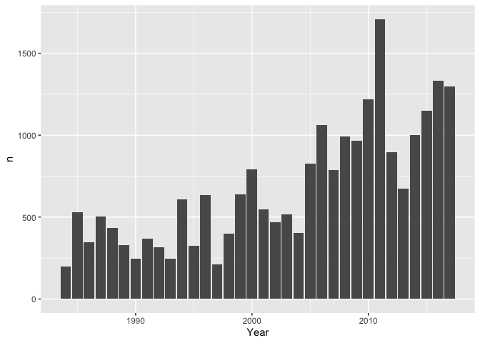
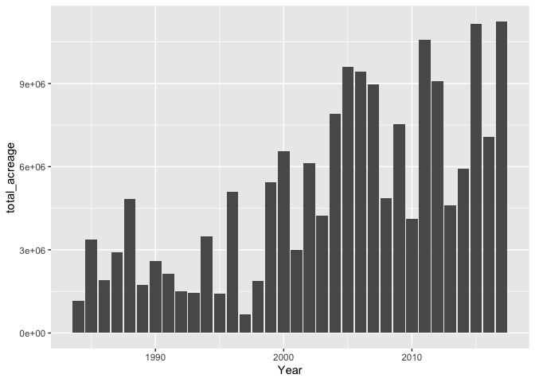
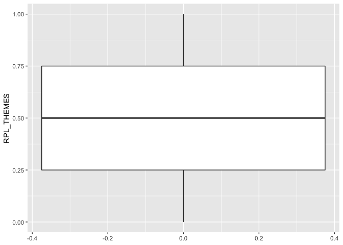
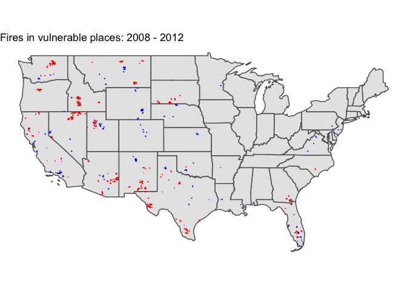
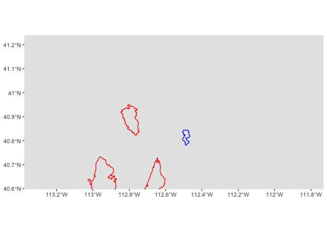
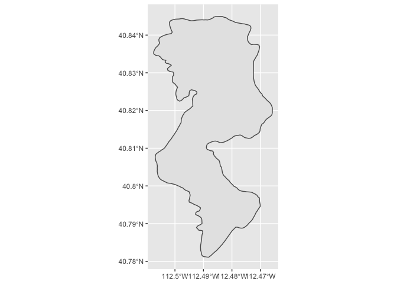
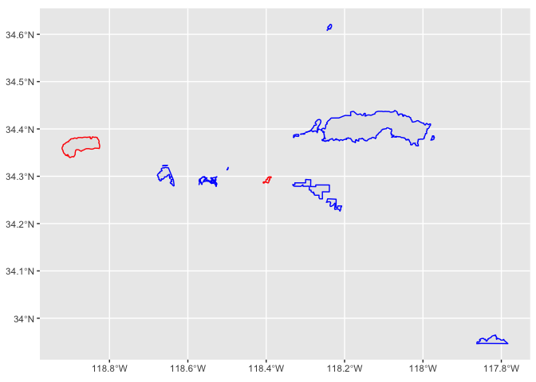
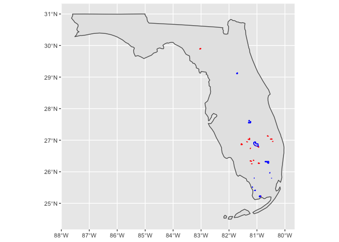
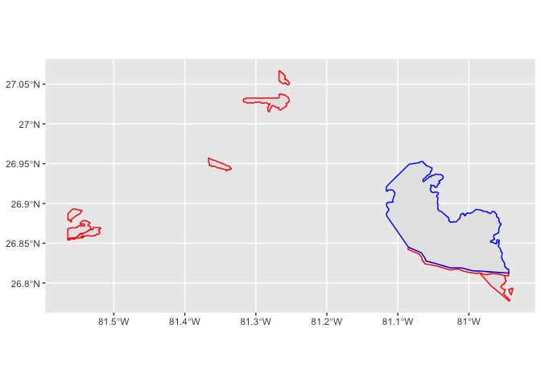
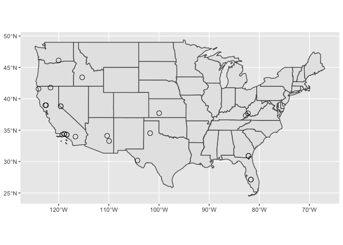

Wildfires + SVI
================
Amy DiPierro
2020-04-22

  - [Checking basic fields](#checking-basic-fields)
      - [Fires](#fires)
      - [SVI](#svi)
  - [Data preparation](#data-preparation)
  - [Mapping](#mapping)
      - [Utah](#utah)
      - [Los Angeles](#los-angeles)
      - [Florida](#florida)
  - [Distance analysis](#distance-analysis)

``` r
# Libraries
library(tidyverse)
library(sf)

# Parameters

# SVI Data
# Source: https://svi.cdc.gov/data-and-tools-download.html
# Download date: 2020-04-21
# Geography: United States
# Year: 2018
file_svi <- here::here("data-raw", "SVI2018_US", "SVI2018_US_tract.shp")

# Monitoring Trends in Burn Severity: Burned Areas Boundary Dataset
# Source: https://www.mtbs.gov/direct-download
# Download date: 2020-04-21
# Geography: United States
# Years: 2006 - 2017
file_fires <- here::here("data-raw", "mtbs_perimeter_data", "mtbs_perims_DD.shp")

#===============================================================================

# Code

# Read in the SVI data
svi <- 
  read_sf(file_svi)

# Read in the fire shapefile data
fires <-
  read_sf(file_fires)

# States
us <-
  ussf::boundaries(
    geography = "state", 
    projection = "longlat",
  ) %>% 
  filter(!NAME %in% c("Alaska", "Hawaii"))
```

# Checking basic fields

## Fires

First, let’s see how many different kinds of fire are in this data:

``` r
fires %>% 
  st_set_geometry(NULL) %>% 
  count(Fire_Type)
```

    ## # A tibble: 6 x 2
    ##   Fire_Type                n
    ##   <chr>                <int>
    ## 1 Complex                  2
    ## 2 Out of Area Response     2
    ## 3 Prescribed Fire       5658
    ## 4 Unknown               3643
    ## 5 Wildfire             13454
    ## 6 Wildland Fire Use      208

Here are the definitions of those fire types, according to the MTBS
documentation:

  - Wildfire - An unplanned, unwanted wildland fire including
    unauthorized human-caused fires, escaped wildland fire use events,
    escaped prescribed fire projects, and all other wildland fires where
    the objective is to put the fire out (definition currently under
    NWCG review).

  - Prescribed Fire - Any fire intentionally ignited by management
    actions in accordance with applicable laws, policies, and
    regulations to meet specific objectives.

  - Wildland Fire Use - An event dealing with the management of a
    naturally ignited wildland fire to accomplish specific prestated
    resource management objectives in predefined geographic areas
    outlined in the Fire Management Plans.

  - Unknown - A fire event whose incident type was not reported from the
    original reporting agency.

  - Complex - Two or more individual incidents located in the same
    general area which are assigned to a single incident commander or
    unified command.

  - Out of Area Response - Multiple resource response to a wildfire
    incident. This term applies exclusively to wildfire incidents.

Let’s see which years had the most unique fires:

``` r
fires %>% 
  st_set_geometry(NULL) %>% 
  count(Year) %>% 
  ggplot() +
  geom_col(aes(x = Year, y = n))
```

<!-- -->

How about the annual acreage burned?

``` r
fires %>% 
  st_set_geometry(NULL) %>% 
  group_by(Year) %>% 
  summarize(total_acreage = sum(Acres, na.rm = TRUE)) %>% 
  ggplot() +
  geom_col(aes(x = Year, y = total_acreage))
```

<!-- -->

## SVI

Per the documentation, the key metric here is RPL\_THEMES – this is the
overall relative score of a Census tract’s vulnerability, where numbers
closer to 1 are more vulnerable and numbers closer to 0 are the least
vulnerable. Please note that RPL\_THEMES uses flags such that:

  - tracts in the top 10% of vulnerability are coded as 1 – these are
    the most vulnerable
  - tracts below the 90th percentile of vulnerability are coded as 0 –
    these are the least vulnerable
  - not enough people = -999

<!-- end list -->

``` r
svi %>% 
  st_set_geometry(NULL) %>%
  filter(RPL_THEMES > -999) %>% 
  ggplot() +
  geom_boxplot(aes(y = RPL_THEMES))
```

<!-- -->

# Data preparation

Let’s keep just the incidents denoted as Wildfire, Complex or Out of
Area Response. And let’s filter to the five years around 2010. It will
be easier to see when vulnerable places and adjacent less-vulnerable
places are hit by fire(s) around the same time if we limit the time
period.

A Ph.D. student acquaintance studying wildfire recovery told me that it
typically takes about 10 years for communities to fully recover from a
bad fire, which is why I’ve chosen this period. Given that there were
many fires reported in 2011, perhaps it’s more likely that some of these
overlap particularly vulnerable or invulnerable communities.

But, certainly, we should explore more recent fires, too.

``` r
fire_types <- c("Wildfire", "Complex", "Out of Area Response")

fires_filtered <-
  fires %>% 
  filter(
    Fire_Type %in% fire_types,
    Year %in% c(2008, 2009, 2010, 2011, 2012)
  )
```

Let’s pull out the most-vulnerable and least vulnerable places.
Arbitrarily, I’ll set these thresholds:

``` r
high_vulnerability <-
  svi %>% 
  filter(RPL_THEMES >= 0.9)

low_vulnerability <-
  svi %>% 
  filter(RPL_THEMES <= 0.1)
```

Now, I’ll find the intersection between fire perimeters and high/low
vulnerability places. For now, I exclude HI and AK for the purpose of
mapping. We’ll want to look at AK on its own, though.

``` r
high_vulnerability_fires <-
  fires_filtered %>% 
  st_intersection(high_vulnerability) %>% 
  filter(!ST_ABBR %in% c("AK", "HI"))
```

    ## although coordinates are longitude/latitude, st_intersection assumes that they are planar

    ## Warning: attribute variables are assumed to be spatially constant throughout all
    ## geometries

``` r
low_vulnerability_fires <-
  fires_filtered %>% 
  st_intersection(low_vulnerability) %>% 
  filter(!ST_ABBR %in% c("AK", "HI"))
```

    ## although coordinates are longitude/latitude, st_intersection assumes that they are planar

    ## Warning: attribute variables are assumed to be spatially constant throughout all
    ## geometries

# Mapping

The following map helps us to identify vulnerable places and adjacent
less-vulnerable places that overlap fire perimeters in this five-year
period:

``` r
us %>% 
  ggplot() +
  geom_sf() +
  geom_sf(data = high_vulnerability_fires, color = "red") +
  geom_sf(data = low_vulnerability_fires, color = "blue") +
  theme_void() +
  labs(title = "Fires in vulnerable places: 2008 - 2012")
```

<!-- -->

### Utah

Let’s zoom in on Utah:

``` r
fires_filtered %>% 
  filter(str_starts(Fire_ID, "UT")) %>% 
  ggplot() +
  geom_sf(data = us %>% filter(NAME == "Utah")) +
  geom_sf(data = high_vulnerability_fires %>% filter (ST_ABBR == "UT"), color = "red") +
  geom_sf(data = low_vulnerability_fires %>% filter (ST_ABBR == "UT"), color = "blue") +
  coord_sf(xlim = c(-113.303, -111.806), ylim = c(40.627, 41.211))
```

<!-- -->

Looks to me like these are high vulnerability and low vulnerability
places in Tooele County:

``` r
high_vulnerability_fires %>% 
  filter (ST_ABBR == "UT") 
```

    ## Simple feature collection with 8 features and 133 fields
    ## geometry type:  POLYGON
    ## dimension:      XY
    ## bbox:           xmin: -113.9763 ymin: 39.90454 xmax: -112.5404 ymax: 40.95099
    ## epsg (SRID):    4269
    ## proj4string:    +proj=longlat +ellps=GRS80 +towgs84=0,0,0,0,0,0,0 +no_defs
    ## # A tibble: 8 x 134
    ##   Fire_ID Fire_Name  Year StartMonth StartDay Fire_Type Acres ST    STATE
    ## * <chr>   <chr>     <dbl>      <dbl>    <dbl> <chr>     <dbl> <chr> <chr>
    ## 1 UT3993… BUTTE      2012          9       17 Wildfire   2204 49    UTAH 
    ## 2 UT4000… IBAPAH     2012          7       29 Wildfire   1574 49    UTAH 
    ## 3 UT4018… FAUST      2012          8        5 Wildfire  22155 49    UTAH 
    ## 4 UT4027… WHITE RO…  2009          8        6 Wildfire   9719 49    UTAH 
    ## 5 UT4054… DALLAS C…  2012          7       27 Wildfire  43387 49    UTAH 
    ## 6 UT4057… EIGHT MI…  2010         10        1 Wildfire   1621 49    UTAH 
    ## 7 UT4060… BIG POLE   2009          8        6 Wildfire  41579 49    UTAH 
    ## 8 UT4083… LAKESIDE   2011          7       16 Wildfire  16165 49    UTAH 
    ## # … with 125 more variables: ST_ABBR <chr>, STCNTY <chr>, COUNTY <chr>,
    ## #   FIPS <chr>, LOCATION <chr>, AREA_SQMI <dbl>, E_TOTPOP <dbl>,
    ## #   M_TOTPOP <dbl>, E_HU <dbl>, M_HU <dbl>, E_HH <dbl>, M_HH <dbl>,
    ## #   E_POV <dbl>, M_POV <dbl>, E_UNEMP <dbl>, M_UNEMP <dbl>, E_PCI <dbl>,
    ## #   M_PCI <dbl>, E_NOHSDP <dbl>, M_NOHSDP <dbl>, E_AGE65 <dbl>, M_AGE65 <dbl>,
    ## #   E_AGE17 <dbl>, M_AGE17 <dbl>, E_DISABL <dbl>, M_DISABL <dbl>,
    ## #   E_SNGPNT <dbl>, M_SNGPNT <dbl>, E_MINRTY <dbl>, M_MINRTY <dbl>,
    ## #   E_LIMENG <dbl>, M_LIMENG <dbl>, E_MUNIT <dbl>, M_MUNIT <dbl>,
    ## #   E_MOBILE <dbl>, M_MOBILE <dbl>, E_CROWD <dbl>, M_CROWD <dbl>,
    ## #   E_NOVEH <dbl>, M_NOVEH <dbl>, E_GROUPQ <dbl>, M_GROUPQ <dbl>, EP_POV <dbl>,
    ## #   MP_POV <dbl>, EP_UNEMP <dbl>, MP_UNEMP <dbl>, EP_PCI <dbl>, MP_PCI <dbl>,
    ## #   EP_NOHSDP <dbl>, MP_NOHSDP <dbl>, EP_AGE65 <dbl>, MP_AGE65 <dbl>,
    ## #   EP_AGE17 <dbl>, MP_AGE17 <dbl>, EP_DISABL <dbl>, MP_DISABL <dbl>,
    ## #   EP_SNGPNT <dbl>, MP_SNGPNT <dbl>, EP_MINRTY <dbl>, MP_MINRTY <dbl>,
    ## #   EP_LIMENG <dbl>, MP_LIMENG <dbl>, EP_MUNIT <dbl>, MP_MUNIT <dbl>,
    ## #   EP_MOBILE <dbl>, MP_MOBILE <dbl>, EP_CROWD <dbl>, MP_CROWD <dbl>,
    ## #   EP_NOVEH <dbl>, MP_NOVEH <dbl>, EP_GROUPQ <dbl>, MP_GROUPQ <dbl>,
    ## #   EPL_POV <dbl>, EPL_UNEMP <dbl>, EPL_PCI <dbl>, EPL_NOHSDP <dbl>,
    ## #   SPL_THEME1 <dbl>, RPL_THEME1 <dbl>, EPL_AGE65 <dbl>, EPL_AGE17 <dbl>,
    ## #   EPL_DISABL <dbl>, EPL_SNGPNT <dbl>, SPL_THEME2 <dbl>, RPL_THEME2 <dbl>,
    ## #   EPL_MINRTY <dbl>, EPL_LIMENG <dbl>, SPL_THEME3 <dbl>, RPL_THEME3 <dbl>,
    ## #   EPL_MUNIT <dbl>, EPL_MOBILE <dbl>, EPL_CROWD <dbl>, EPL_NOVEH <dbl>,
    ## #   EPL_GROUPQ <dbl>, SPL_THEME4 <dbl>, RPL_THEME4 <dbl>, SPL_THEMES <dbl>,
    ## #   RPL_THEMES <dbl>, F_POV <int>, F_UNEMP <int>, F_PCI <int>, …

<https://censusreporter.org/profiles/05000US49045-tooele-county-ut/>

This is the fire in the low-vulnerability area:

``` r
low_vulnerability_fires %>% 
  filter(Fire_Name == "SHANTY CANYON") %>% 
  ggplot() +
  geom_sf()
```

<!-- -->

### Los Angeles

There were a bunch of fires in LA and Ventura counties during this
period:

``` r
ggplot() +
  geom_sf(
    data = 
      high_vulnerability_fires %>% 
      filter(COUNTY %in% c("Los Angeles", "Ventura")), 
    color = "red"
  ) +
  geom_sf(
    data = 
      low_vulnerability_fires %>% 
      filter(COUNTY %in% c("Los Angeles", "Ventura")), 
    color = "blue"
  )
```

<!-- -->

The tiny red dot between the blue areas is a Census tract hit by the
2008 Marek wildfire.

``` r
high_vulnerability_fires %>% 
      filter(COUNTY %in% c("Los Angeles", "Ventura"))
```

    ## Simple feature collection with 2 features and 133 fields
    ## geometry type:  POLYGON
    ## dimension:      XY
    ## bbox:           xmin: -118.921 ymin: 34.28553 xmax: -118.3874 ymax: 34.3832
    ## epsg (SRID):    4269
    ## proj4string:    +proj=longlat +ellps=GRS80 +towgs84=0,0,0,0,0,0,0 +no_defs
    ## # A tibble: 2 x 134
    ##   Fire_ID Fire_Name  Year StartMonth StartDay Fire_Type Acres ST    STATE
    ## * <chr>   <chr>     <dbl>      <dbl>    <dbl> <chr>     <dbl> <chr> <chr>
    ## 1 CA3435… GUIBERSON  2009          9       22 Wildfire  19356 06    CALI…
    ## 2 CA3430… MAREK      2008         10       12 Wildfire   4941 06    CALI…
    ## # … with 125 more variables: ST_ABBR <chr>, STCNTY <chr>, COUNTY <chr>,
    ## #   FIPS <chr>, LOCATION <chr>, AREA_SQMI <dbl>, E_TOTPOP <dbl>,
    ## #   M_TOTPOP <dbl>, E_HU <dbl>, M_HU <dbl>, E_HH <dbl>, M_HH <dbl>,
    ## #   E_POV <dbl>, M_POV <dbl>, E_UNEMP <dbl>, M_UNEMP <dbl>, E_PCI <dbl>,
    ## #   M_PCI <dbl>, E_NOHSDP <dbl>, M_NOHSDP <dbl>, E_AGE65 <dbl>, M_AGE65 <dbl>,
    ## #   E_AGE17 <dbl>, M_AGE17 <dbl>, E_DISABL <dbl>, M_DISABL <dbl>,
    ## #   E_SNGPNT <dbl>, M_SNGPNT <dbl>, E_MINRTY <dbl>, M_MINRTY <dbl>,
    ## #   E_LIMENG <dbl>, M_LIMENG <dbl>, E_MUNIT <dbl>, M_MUNIT <dbl>,
    ## #   E_MOBILE <dbl>, M_MOBILE <dbl>, E_CROWD <dbl>, M_CROWD <dbl>,
    ## #   E_NOVEH <dbl>, M_NOVEH <dbl>, E_GROUPQ <dbl>, M_GROUPQ <dbl>, EP_POV <dbl>,
    ## #   MP_POV <dbl>, EP_UNEMP <dbl>, MP_UNEMP <dbl>, EP_PCI <dbl>, MP_PCI <dbl>,
    ## #   EP_NOHSDP <dbl>, MP_NOHSDP <dbl>, EP_AGE65 <dbl>, MP_AGE65 <dbl>,
    ## #   EP_AGE17 <dbl>, MP_AGE17 <dbl>, EP_DISABL <dbl>, MP_DISABL <dbl>,
    ## #   EP_SNGPNT <dbl>, MP_SNGPNT <dbl>, EP_MINRTY <dbl>, MP_MINRTY <dbl>,
    ## #   EP_LIMENG <dbl>, MP_LIMENG <dbl>, EP_MUNIT <dbl>, MP_MUNIT <dbl>,
    ## #   EP_MOBILE <dbl>, MP_MOBILE <dbl>, EP_CROWD <dbl>, MP_CROWD <dbl>,
    ## #   EP_NOVEH <dbl>, MP_NOVEH <dbl>, EP_GROUPQ <dbl>, MP_GROUPQ <dbl>,
    ## #   EPL_POV <dbl>, EPL_UNEMP <dbl>, EPL_PCI <dbl>, EPL_NOHSDP <dbl>,
    ## #   SPL_THEME1 <dbl>, RPL_THEME1 <dbl>, EPL_AGE65 <dbl>, EPL_AGE17 <dbl>,
    ## #   EPL_DISABL <dbl>, EPL_SNGPNT <dbl>, SPL_THEME2 <dbl>, RPL_THEME2 <dbl>,
    ## #   EPL_MINRTY <dbl>, EPL_LIMENG <dbl>, SPL_THEME3 <dbl>, RPL_THEME3 <dbl>,
    ## #   EPL_MUNIT <dbl>, EPL_MOBILE <dbl>, EPL_CROWD <dbl>, EPL_NOVEH <dbl>,
    ## #   EPL_GROUPQ <dbl>, SPL_THEME4 <dbl>, RPL_THEME4 <dbl>, SPL_THEMES <dbl>,
    ## #   RPL_THEMES <dbl>, F_POV <int>, F_UNEMP <int>, F_PCI <int>, …

<https://censusreporter.org/profiles/14000US06037104204-census-tract-104204-los-angeles-ca/>

### Florida

Check out what’s happening in the everglades:

``` r
fires_filtered %>% 
  filter(str_starts(Fire_ID, "FL")) %>% 
  ggplot() +
  geom_sf(data = us %>% filter(NAME == "Florida")) +
  geom_sf(data = high_vulnerability_fires %>% filter(ST_ABBR == "FL"), color = "red") +
  geom_sf(data = low_vulnerability_fires %>% filter(ST_ABBR == "FL"), color = "blue")
```

<!-- -->

Looks like the big blue (less-vulnerable) fire bordered by the red
(vulnerable) perimeter is the Myakka Cutt fire.

``` r
low_vulnerability_fires %>% 
  filter(COUNTY == "Glades") %>% 
  arrange(desc(Acres))
```

    ## Simple feature collection with 2 features and 133 fields
    ## geometry type:  GEOMETRY
    ## dimension:      XY
    ## bbox:           xmin: -81.11631 ymin: 26.81246 xmax: -80.94359 ymax: 26.95283
    ## epsg (SRID):    4269
    ## proj4string:    +proj=longlat +ellps=GRS80 +towgs84=0,0,0,0,0,0,0 +no_defs
    ## # A tibble: 2 x 134
    ##   Fire_ID Fire_Name  Year StartMonth StartDay Fire_Type Acres ST    STATE
    ##   <chr>   <chr>     <dbl>      <dbl>    <dbl> <chr>     <dbl> <chr> <chr>
    ## 1 FL2687… MYAKKA C…  2008          5        2 Wildfire  36877 12    FLOR…
    ## 2 FL2680… GRASSY I…  2008          5        1 Wildfire   1961 12    FLOR…
    ## # … with 125 more variables: ST_ABBR <chr>, STCNTY <chr>, COUNTY <chr>,
    ## #   FIPS <chr>, LOCATION <chr>, AREA_SQMI <dbl>, E_TOTPOP <dbl>,
    ## #   M_TOTPOP <dbl>, E_HU <dbl>, M_HU <dbl>, E_HH <dbl>, M_HH <dbl>,
    ## #   E_POV <dbl>, M_POV <dbl>, E_UNEMP <dbl>, M_UNEMP <dbl>, E_PCI <dbl>,
    ## #   M_PCI <dbl>, E_NOHSDP <dbl>, M_NOHSDP <dbl>, E_AGE65 <dbl>, M_AGE65 <dbl>,
    ## #   E_AGE17 <dbl>, M_AGE17 <dbl>, E_DISABL <dbl>, M_DISABL <dbl>,
    ## #   E_SNGPNT <dbl>, M_SNGPNT <dbl>, E_MINRTY <dbl>, M_MINRTY <dbl>,
    ## #   E_LIMENG <dbl>, M_LIMENG <dbl>, E_MUNIT <dbl>, M_MUNIT <dbl>,
    ## #   E_MOBILE <dbl>, M_MOBILE <dbl>, E_CROWD <dbl>, M_CROWD <dbl>,
    ## #   E_NOVEH <dbl>, M_NOVEH <dbl>, E_GROUPQ <dbl>, M_GROUPQ <dbl>, EP_POV <dbl>,
    ## #   MP_POV <dbl>, EP_UNEMP <dbl>, MP_UNEMP <dbl>, EP_PCI <dbl>, MP_PCI <dbl>,
    ## #   EP_NOHSDP <dbl>, MP_NOHSDP <dbl>, EP_AGE65 <dbl>, MP_AGE65 <dbl>,
    ## #   EP_AGE17 <dbl>, MP_AGE17 <dbl>, EP_DISABL <dbl>, MP_DISABL <dbl>,
    ## #   EP_SNGPNT <dbl>, MP_SNGPNT <dbl>, EP_MINRTY <dbl>, MP_MINRTY <dbl>,
    ## #   EP_LIMENG <dbl>, MP_LIMENG <dbl>, EP_MUNIT <dbl>, MP_MUNIT <dbl>,
    ## #   EP_MOBILE <dbl>, MP_MOBILE <dbl>, EP_CROWD <dbl>, MP_CROWD <dbl>,
    ## #   EP_NOVEH <dbl>, MP_NOVEH <dbl>, EP_GROUPQ <dbl>, MP_GROUPQ <dbl>,
    ## #   EPL_POV <dbl>, EPL_UNEMP <dbl>, EPL_PCI <dbl>, EPL_NOHSDP <dbl>,
    ## #   SPL_THEME1 <dbl>, RPL_THEME1 <dbl>, EPL_AGE65 <dbl>, EPL_AGE17 <dbl>,
    ## #   EPL_DISABL <dbl>, EPL_SNGPNT <dbl>, SPL_THEME2 <dbl>, RPL_THEME2 <dbl>,
    ## #   EPL_MINRTY <dbl>, EPL_LIMENG <dbl>, SPL_THEME3 <dbl>, RPL_THEME3 <dbl>,
    ## #   EPL_MUNIT <dbl>, EPL_MOBILE <dbl>, EPL_CROWD <dbl>, EPL_NOVEH <dbl>,
    ## #   EPL_GROUPQ <dbl>, SPL_THEME4 <dbl>, RPL_THEME4 <dbl>, SPL_THEMES <dbl>,
    ## #   RPL_THEMES <dbl>, F_POV <int>, F_UNEMP <int>, F_PCI <int>, …

<https://www.cnn.com/2008/US/05/19/florida.wildfires/index.html>

``` r
ggplot() +
  geom_sf(
    data = 
      high_vulnerability_fires %>% 
      filter(COUNTY %in% c("Glades")), 
    color = "red"
  ) +
  geom_sf(
    data = 
      low_vulnerability_fires %>% 
      filter(COUNTY %in% c("Glades")), 
    color = "blue"
  )
```

<!-- -->

# Distance analysis

First, let’s find the centroids of the high vulnerability and low
vulnerability places we previously identified:

``` r
high_centroids <-
  high_vulnerability %>% 
  mutate(geometry = st_centroid(geometry))
```

    ## Warning in st_centroid.sfc(geometry): st_centroid does not give correct
    ## centroids for longitude/latitude data

``` r
low_centroids <-
  low_vulnerability %>% 
  mutate(geometry = st_centroid(geometry))
```

    ## Warning in st_centroid.sfc(geometry): st_centroid does not give correct
    ## centroids for longitude/latitude data

Now, let’s filter to only the centroids that are close to one another:

``` r
close_centroids <-
  st_join(high_centroids, low_centroids, join = st_is_within_distance, dist = 1)
```

Let’s see if any of these centroids are within a fire perimeter:

``` r
close_fires <- 
  close_centroids %>% 
  st_intersection(fires)
```

    ## although coordinates are longitude/latitude, st_intersection assumes that they are planar

    ## Warning: attribute variables are assumed to be spatially constant throughout all
    ## geometries

``` r
close_fires %>% 
  filter(ST_ABBR.x != "AK") %>% 
  ggplot() +
  geom_sf(data = us) +
  geom_sf(size = 3, shape = 21) 
```

<!-- -->

The problem here is that what we’re really picking up here is not
adjacent communities hit by a fire the same year, but the same community
hit by a fire in different years.

``` r
close_fires %>% 
  filter(ST_ABBR.x == "CA") %>% 
  count(COUNTY.x, Year, RPL_THEMES.x, sort = TRUE)
```

    ## Simple feature collection with 10 features and 4 fields
    ## geometry type:  POINT
    ## dimension:      XY
    ## bbox:           xmin: -124.0231 ymin: 33.97282 xmax: -116.6546 ymax: 41.78964
    ## epsg (SRID):    4269
    ## proj4string:    +proj=longlat +ellps=GRS80 +towgs84=0,0,0,0,0,0,0 +no_defs
    ## # A tibble: 10 x 5
    ##    COUNTY.x     Year RPL_THEMES.x     n             geometry
    ##    <chr>       <dbl>        <dbl> <int>          <POINT [°]>
    ##  1 Del Norte    1988        0.941     1 (-124.0231 41.58293)
    ##  2 Lake         1992        0.979     1 (-122.6479 38.98589)
    ##  3 Lake         2015        0.952     1  (-122.509 38.97402)
    ##  4 Los Angeles  2008        0.960     1 (-118.3955 34.28933)
    ##  5 Los Angeles  2017        0.960     1 (-118.3955 34.28933)
    ##  6 Riverside    1995        0.9       1 (-116.6546 33.97282)
    ##  7 Siskiyou     1999        0.944     1 (-121.6223 41.78964)
    ##  8 Ventura      1998        0.917     1 (-118.8772 34.41114)
    ##  9 Ventura      2003        0.917     1 (-118.8772 34.41114)
    ## 10 Ventura      2005        0.939     1 (-119.2884 34.29973)

``` r
close_fires %>% 
  count(COUNTY.x, ST_ABBR.x, Year, RPL_THEMES.x) %>% 
  arrange(desc(RPL_THEMES.x))
```

    ## Simple feature collection with 26 features and 5 fields
    ## geometry type:  POINT
    ## dimension:      XY
    ## bbox:           xmin: -156.2317 ymin: 27.12567 xmax: -81.6852 ymax: 65.34145
    ## epsg (SRID):    4269
    ## proj4string:    +proj=longlat +ellps=GRS80 +towgs84=0,0,0,0,0,0,0 +no_defs
    ## # A tibble: 26 x 6
    ##    COUNTY.x    ST_ABBR.x  Year RPL_THEMES.x     n             geometry
    ##    <chr>       <chr>     <dbl>        <dbl> <int>          <POINT [°]>
    ##  1 Navajo      AZ         2002        0.986     1 (-110.3322 34.10914)
    ##  2 Douglas     NV         2012        0.979     1 (-119.5861 38.81799)
    ##  3 Douglas     NV         2017        0.979     1 (-119.5861 38.81799)
    ##  4 Lake        CA         1992        0.979     1 (-122.6479 38.98589)
    ##  5 Yakima      WA         2000        0.974     1 (-120.0101 46.11277)
    ##  6 Swisher     TX         2017        0.969     1 (-101.7726 34.52627)
    ##  7 Presidio    TX         2009        0.963     1 (-104.2916 30.17582)
    ##  8 Graham      AZ         2012        0.962     1 (-109.9475 33.27597)
    ##  9 Los Angeles CA         2008        0.960     1 (-118.3955 34.28933)
    ## 10 Los Angeles CA         2017        0.960     1 (-118.3955 34.28933)
    ## # … with 16 more rows

Less-close centroids:

``` r
less_close_centroids <-
  st_join(high_centroids, low_centroids, join = st_is_within_distance, dist = 10)
```

Let’s see if any of these centroids are within a fire perimeter:

``` r
less_close_fires <- 
  close_centroids %>% 
  st_intersection(fires)
```

    ## although coordinates are longitude/latitude, st_intersection assumes that they are planar

    ## Warning: attribute variables are assumed to be spatially constant throughout all
    ## geometries

``` r
less_close_fires %>% 
  filter(ST_ABBR.x != "AK") %>% 
  ggplot() +
  geom_sf(data = us) +
  geom_sf(size = 3, shape = 21) 
```

<!-- -->
